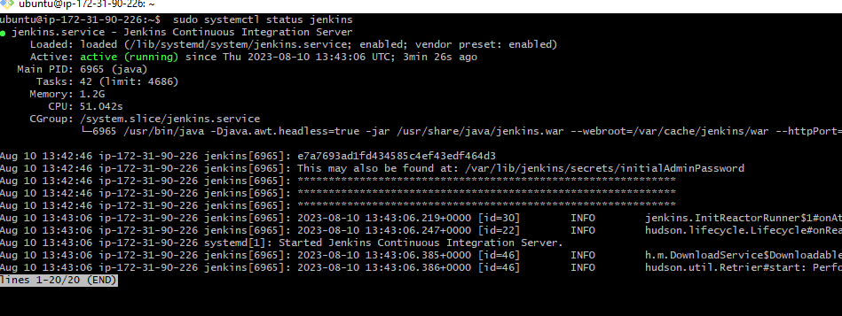
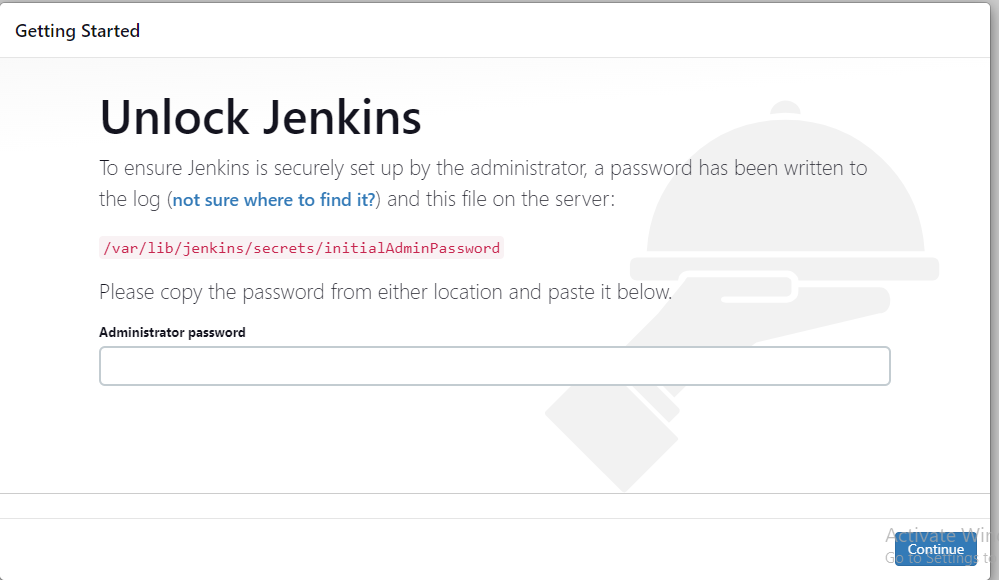
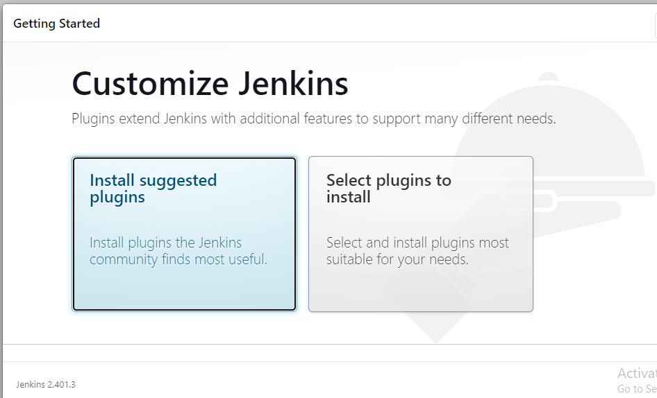
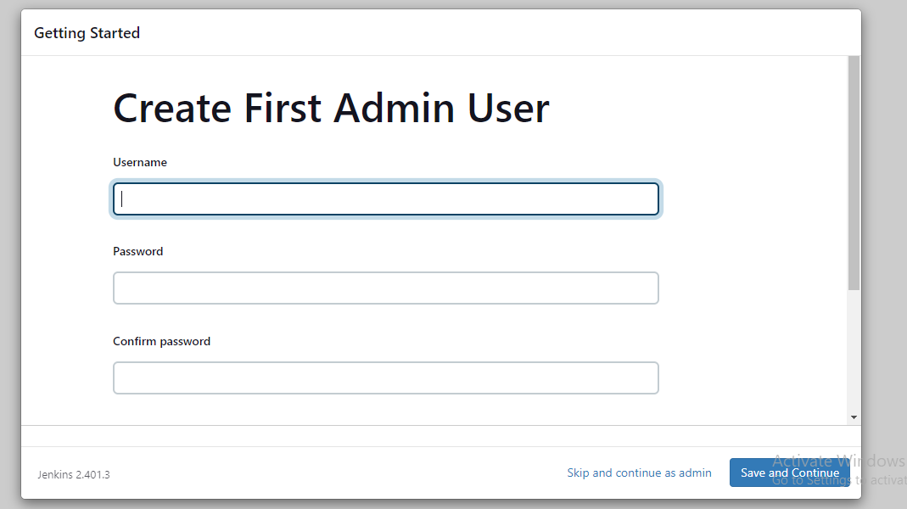
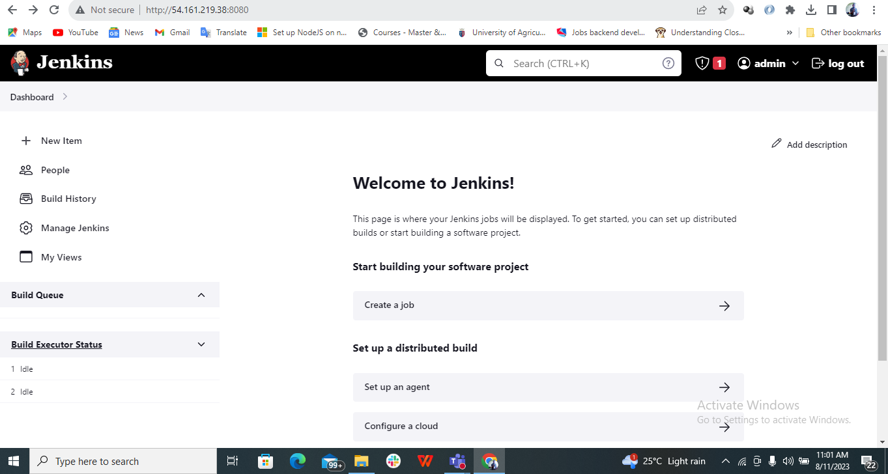

## Setting up Jenkins for Terraform CICD

In this practice lab, we will be learning how to set up jenkins for implementing **Continuous Integration** and **Continuous Deployment**. We will be using infrastructure code written in Terraform as opposed to an application code for our practice. 

By the end of this lab, you will be comfortable with configuring jenkins, using jenkins to automate the provisioning of cloud infrastructure using terraform, and much more.

Before diving in, let us go over some important concepts. I mean *Continous Integration* and *Continous Deployment*.

### What is Continuous Integration

Continuous Integration (CI) is a software development practice that involves automatically integrating small code changes from multiple developers into a shared repository on a frequent basis. 

The main goal of CI is to detect and address integration issues early in the development process, thus reducing the chances of bugs and conflicts that may arise when multiple developers' changes are combined.

### What is Continuous Deployment

Continuous Deployment (CD) is an extension of the Continuous Integration (CI) process in software development. It involves automatically deploying code changes that have passed all tests and checks directly into production. 

The primary goal of continuous deployment is to deliver new features, enhancements, and bug fixes to users as quickly as possible while maintaining a high level of quality and reliability.

A close but slightly different concept is **Continuous Delivery**. In continous delivery code changes are not automatically deployed to production server directly from the CI server, it has a manual step in the form of an approval from the team lead or engineering manager.


### Configuring Jenkins, Terraform, AWSCLI on an EC2 Instance.

We will using an EC2 instance as our Jenkins CI server. In other to successfully run terraform job on our CI server, we will have to install terraform, install and configure awscli with the right permission to deploy resources in our AWS account.

A less secure way to do so is to create an IAM user and grant the user admin right. Another option is to create and attach a role to the EC2 instance running jenkins.

We will be using an IAM user with limited permission for our practice. That said, lets proceed with the steps enumerated below:

**Step 1:** Provision an EC2 Instance of instance type t2.medium running ubuntu 22.04 and open port 8080 to anywhere using the security group.

You can go over the lab **Implementing Load Balancer with Nginx** if you need a refresher on the steps to provision EC2 instance on AWS. 

**Step 2:** Install Jenkins

- Install Java

```
    sudo apt-get install fontconfig openjdk-11-jre -y
```

- Add repository key to your system:

```
    curl -fsSL https://pkg.jenkins.io/debian-stable/jenkins.io-2023.key | sudo tee \
    /usr/share/keyrings/jenkins-keyring.asc > /dev/null
```

- Append the Debian package repository address to the server’s sources.list:

```
    echo deb [signed-by=/usr/share/keyrings/jenkins-keyring.asc] \
    https://pkg.jenkins.io/debian-stable binary/ | sudo tee \
    /etc/apt/sources.list.d/jenkins.list > /dev/null
```

- Update apt Repository:

```
    sudo apt update
```
- Finally, install Jenkins and its dependencies:

```
    sudo apt install jenkins
```
- Verify that jenkins is running:

```
    sudo systemctl status jenkins
```



- Next view the jenkins application on your browser. You will see the unlock jenkins screen. You need to get the initial password to proceed.

```
    http://your_server_ip_or_domain:8080
```

- Get the jenkins initial password with the command below:

```
    sudo cat /var/lib/jenkins/secrets/initialAdminPassword
```



- The next screen presents the option of installing sugested plugins or selected plugins. You select the suggested plugins



- The next screen presents presents the option of creating an Admin user. Fill the required fields then click on save and finish. You might face challenges while creating a user, in that case you can skip and make use of the default admin user together with the initial password.



- The next screen says jenkins is ready, click on start using jenkins. It takes you to jenkin's home page.



**Step 3:** Install Terraform

- Add Hashicorp GPG key:

```
    curl -fsSL https://apt.releases.hashicorp.com/gpg | sudo apt-key add -

```

- Add Hashicorp to your ubuntu repository:

```
    sudo apt-add-repository "deb [arch=amd64] https://apt.releases.hashicorp.com $(lsb_release -cs) main"

```

- Install terraform:

```
    sudo apt update; sudo apt install terraform -y

```

- Verify the version of terraform installed:

```
    terraform -version

```

**Step 4:** Install AWSCLI

- Update ubuntu packages:

```
    sudo apt update -y
```
- Install awscli:

```
    sudo apt install awscli
```

- Verify the version of awscli installed:

```
    aws --version
```
**Step 5:** Configure AWSCLI

- Create an IAM user

- Attach an EC2FullAccess policy to the user

- Create secret access and access key for the user

- configure the awscli using the command below:
It will prompt you to supply your access and secret access keys.

```
    aws configure
```

