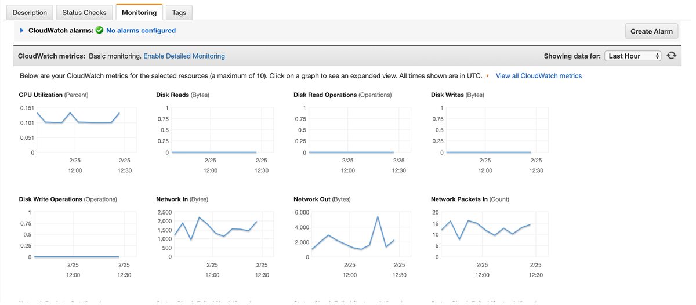
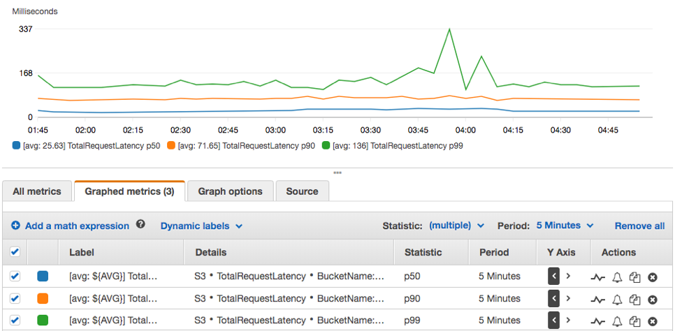

## Monitoring Infrastructure in AWS (Cloudwatch, Cloud trail)

Imagine you've just launched your startup's new application on Amazon Web Services (AWS). Excitedly, you see traffic start to flow in as users begin to interact with your service. However, with success comes responsibility. As your application grows, so does the complexity of managing its underlying infrastructure. How do you ensure that everything continues to run smoothly? How do you detect and address issues before they impact your users? This is where monitoring your infrastructure becomes crucial.

Monitoring, refers to the process of observing and collecting data about the performance, health, and behavior of systems, applications, networks, or infrastructure components. The primary goal of monitoring is to ensure that these systems operate effectively, efficiently, and securely, while also detecting and addressing any issues or anomalies in a timely manner.

### AWS CloudWatch and CloudTrail
AWS CloudWatch is a monitoring and observability service provided by Amazon Web Services (AWS). It allows users to collect and track metrics, monitor logs, set alarms, and automatically react to changes in AWS resources and applications running on the AWS infrastructure. CloudWatch provides insights into the performance, health, and operational status of AWS resources and applications, helping users to troubleshoot issues, optimize resource utilization, and ensure the reliability of their systems. 

AWS CloudTrail on the other hand is also a service provided by Amazon Web Services (AWS) that enables governance, compliance, operational auditing, and risk auditing of your AWS account. CloudTrail records and logs all API activity in your AWS account, providing a comprehensive trail of events that can be used for security analysis, resource change tracking, troubleshooting, and compliance auditing.

## CloudWatch Metrics and Alarms

Amazon CloudWatch Metrics and Alarms are essential components of the Amazon CloudWatch service, which provides monitoring and observability capabilities for AWS resources and applications. Let's delve into each of these components:

### CloudWatch Metrics

CloudWatch Metrics are data points representing the behavior of AWS resources and applications over time. These metrics can be collected from various AWS services such as Amazon EC2, Amazon RDS, Amazon S3, AWS Lambda, and many others. Metrics provide insights into the performance, health, and operational status of these resources, allowing users to monitor and analyze their behavior.

Key aspects of CloudWatch Metrics include:

Default and Custom Metrics: AWS services automatically publish default metrics to CloudWatch, such as CPU utilization, network traffic, and disk I/O for EC2 instances. Additionally, users can create custom metrics to monitor specific aspects of their applications or services.

Namespace and Dimensions: Metrics are organized into namespaces, which categorize related metrics together. Within each namespace, metrics can have dimensions that further specify the resource or aspect being monitored. For example, an EC2 instance metric might have dimensions such as InstanceId or InstanceType.

Timestamps and Units: Each metric data point includes a timestamp indicating when the measurement was taken, as well as a unit specifying the measurement's scale (e.g., bytes, percentage, seconds).

Retention and Granularity: CloudWatch retains metric data for different periods depending on the data's age and granularity. Users can specify the granularity of their metric data, ranging from one-minute to one-day intervals.

CloudWatch Alarms:

CloudWatch Alarms allow users to define thresholds on CloudWatch Metrics and trigger actions when these thresholds are breached. Alarms are used to proactively monitor the health and performance of AWS resources and applications, enabling users to respond promptly to changes in their environment.

Key aspects of CloudWatch Alarms include:

Thresholds and Actions: Users can set thresholds on CloudWatch Metrics, specifying conditions that, when met or exceeded, trigger alarm states. When an alarm enters an alarm state, users can configure actions such as sending notifications via Amazon SNS, executing AWS Lambda functions, or auto-scaling resources.

Alarm States: CloudWatch Alarms have three possible states: OK, INSUFFICIENT_DATA, and ALARM. The OK state indicates that the metric is within the defined threshold, while the ALARM state indicates that the threshold has been breached. The INSUFFICIENT_DATA state occurs when there is not enough data to evaluate the alarm.

Alarm History: CloudWatch maintains a history of alarm state changes, allowing users to track when alarms transition between states and investigate the circumstances surrounding each state change.

Configuration and Management: Users can create, modify, and delete alarms through the CloudWatch Management Console, AWS CLI, or SDKs. Alarms can be managed individually or as part of larger monitoring configurations, such as CloudFormation templates or AWS Auto Scaling policies.

## Monitoring AWS EC2 using CloudWatch
Now that we an idea of what AWS CloudWatch and CloudTrail is all about, let launch an EC2 instance and monitor it using CloudWatch

### Step 1: Launch an EC2 Instance.
From our previous knowledge of EC2, launch an ubuntu EC2 Instance

### Step 2: Create an IAM Role With CloudWatchFull Access and Attach The Role To Your EC2

1. Navigate to the IAM console.

2. In the IAM Console navigation click on roles.

3. Follow the image to create a role with `CloudWatchFullAccess` policy
