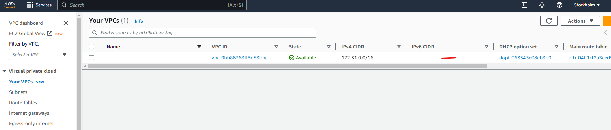
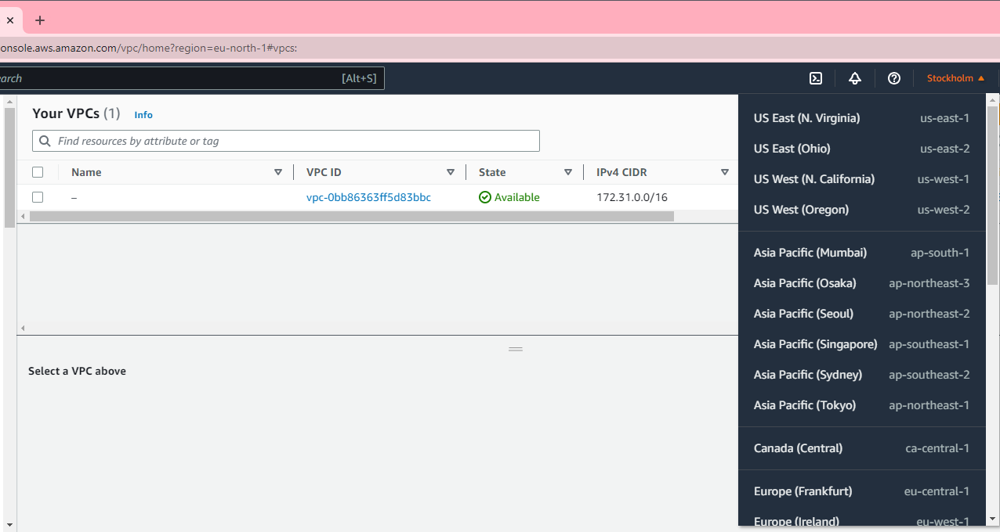
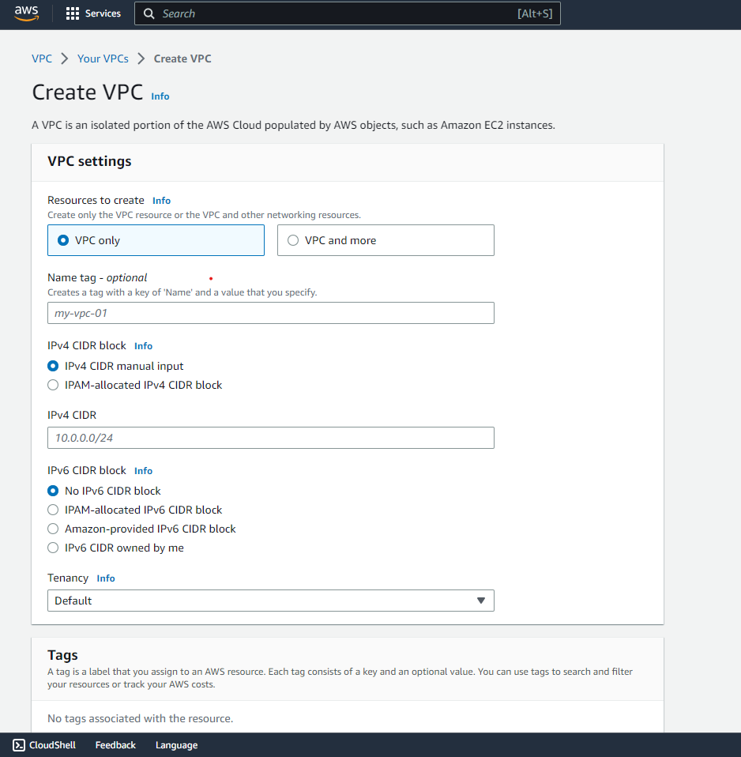
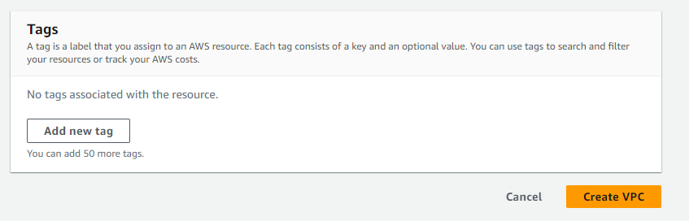
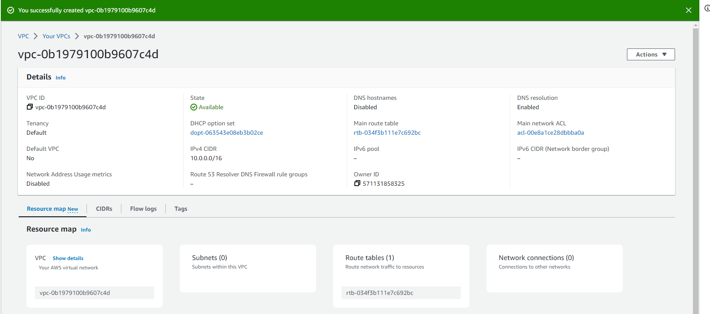
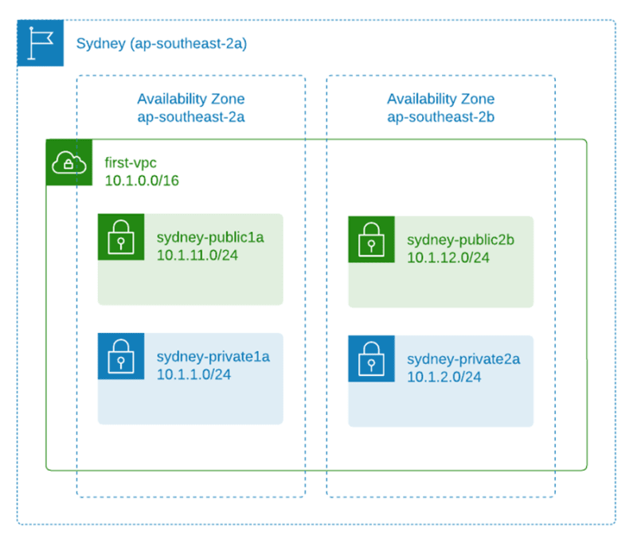

"title": "VPC Creation and Subnet Configuration",

AWS VPC Creation and Subnet Configuration
=========================================

Welcome to AWS networking! This field uses Virtual Private Clouds (VPCs) and subnets to create the backbone of your cloud-based projects. In this article, we'll simplify the complex aspects of AWS networking, highlighting the useful and adaptable nature of VPCs and subnets. Whether you're a long-time AWS user or just starting out, this guide will help you understand VPCs and subnets better. So, get ready as we're going to take an interesting trip to discover how to fully use AWS networking and make the most out of your cloud-based projects.

What is an Amazon VPC?
======================

An Amazon Virtual Private Cloud (VPC) is like your own private section of the Amazon cloud, where you can place and manage your resources (like servers or databases). You control who and what can go in and out, just like a gated community.

#### The essential steps to creating a VPC and configuring core network services. The topics to be covered are: #####

+ The Default VPC
+ Creating a new VPC
+ Creating and configuring subnets
+ Network security and security groups
+ Routes tables, the internet gateway and NAT gateways
  

### The Default VPC

The Default VPC is like a starter pack provided by Amazon for your cloud resources. It's a pre-configured space in the Amazon cloud where you can immediately start deploying your applications or services. It has built-in security and network settings to help you get up and running quickly, but you can adjust these as you see fit.

A Default VPC, which Amazon provides for you in each region (think of a region as a separate city), is like a pre-built house in that city. This house comes with some default settings to help you move in and start living (or start deploying your applications) immediately. But just like a real house, you can change these settings according to your needs.

### Creating a new VPC

As we want to learn step by step and observe the components, choose the "VPC only" option, we'll use the "VPC and more" option later.
Enter "first-vpc" as the name tag and "10.1.0.0/16" as the IPv4 CIDR. The "10.1.0.0/16" will be the primary IPv4 block and you can add a secondary IPv4 block e.g., "100.64.0.0/16". The use case of secondary CIDR block could be because you're running out of IPs and need to add additional block, or there's a VPC with overlapping CIDR which you need to peer or connect. See this blog post on how a secondary CIDR block is being used in an overlapping IP scenario: https://aws.amazon.com/blogs/networking-and-content-delivery/how-to-solve-private-ip-exhaustion-with-private-nat-solution/

Leave the tags as default, you can add more tags if you want and click `CREATE VPC`

As soon as the VPC is created, it's assigned with a vpc-id and there's a route table created that serves as the main route table - rtb-034f3b111e7c692bc in below example.

Now you have a VPC and a route table, but you won't be able to put anything inside. If you try to create an EC2 instance for example, you can't proceed as it requires subnets.

### Creating and configuring subnets

##### What are Subnets?
Subnets are like smaller segments within a VPC that help you organize and manage your resources. Subnets are like dividing an office building into smaller sections, where each section represents a department. In this analogy, subnets are created to organize and manage the network effectively.

Subnet name | AZ | CIDR block
--------|---------|----------
subnet-public1a| ap-souhteast-2a | 10.1.11.0/24
subnet-public2b| ap-souhteast-2b | 10.1.12.0/24
subnet-private1a| ap-souhteast-2a | 10.1.1.0/24
subnet-private2b| ap-souhteast-2a | 10.1.2.0/24

----
Go to VPC > Subnets > Create Subnets and select the VPC that you've created previously - the `test-vpc` or anything you tagged your VPC
