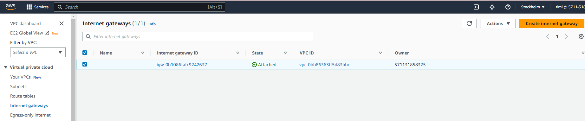
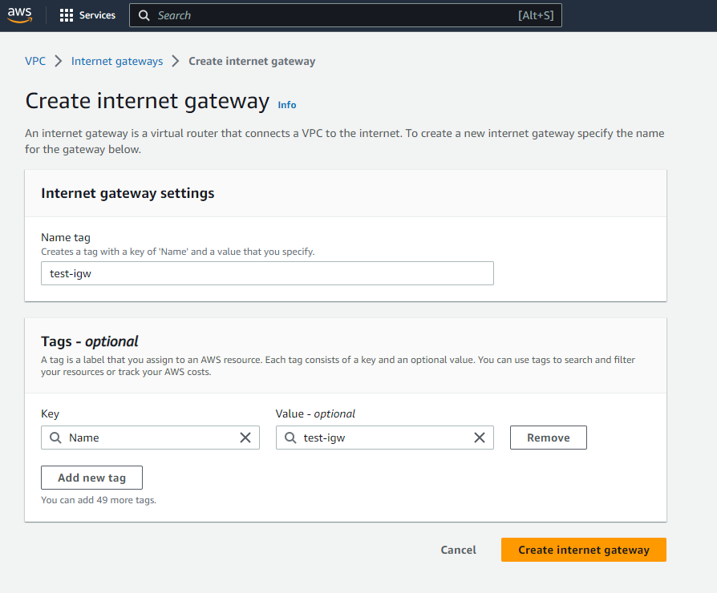
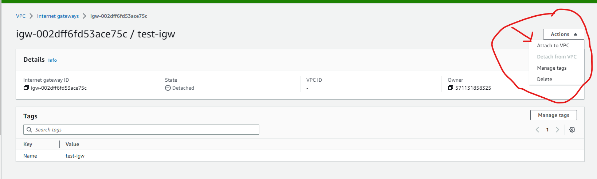
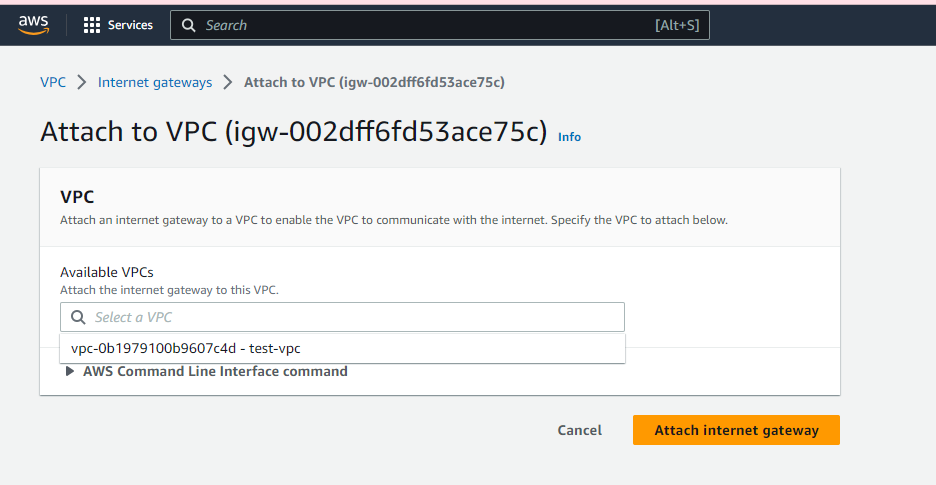

 "title": "Internet Gateway and Routing Table",

### Introduction to Internet Gateway and Routing Table

Just like in a real city, in your virtual city (VPC), you need roads (Internet Gateway) for people (data) to come and go. And you also need a map or GPS (Routing Table) to tell people (data) which way to go to reach their destination.

####  What is an Internet Gateway?

An Internet Gateway in AWS is like a road that connects your city (VPC) to the outside world (the internet). Without this road, people (data) can't come in or go out of your city (VPC).

##### Deep Dive into Internet Gateways

To give your public subnet access to the main road (internet), you need an Internet Gateway. This acts like the entrance and exit to your property. We'll show you how to create and attach an Internet Gateway to your VPC.

## Public Subnets
Technically, the subnets are still private. You'll need these to make it work as public subnets:

+ An Internet Gateway (IGW) attached to the VPC
+ Route table with default route towards the IGW
+ Public IP assigned to the AWS resources (e.g., EC2 instances)
  

Go to VPC > **Internet gateways** and click **"Create internet gateway"**

Put a name tag and click create internet gateway

Attach the IGW to the test-vpc

select the VPC

We want the private subnets to be private, we don't want the private subnets to have a default route to the Internet. For that, we'll need to create a separate route table for the public subnets.

### Creating and Configuring Routing Tables

Now that we have our entrance and exit (Internet Gateway), we need to give directions to our resources. This is done through a Routing Table. It's like a map, guiding your resources on how to get in and out of your VPC.

Let's go to the route table menu and create a route table for the public subnets.

