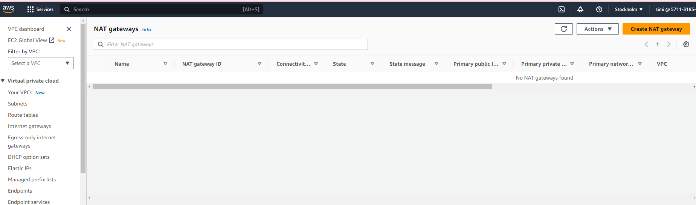

## Introduction to Private Subnets and NAT Gateway

In your AWS Virtual Private Cloud (VPC), private subnets are secluded areas where you can place resources that should not be directly exposed to the internet. But what if these resources need to access the internet for updates or downloads? This is where the NAT Gateway comes in.

A private subnet in AWS is like a secure room inside your house (VPC) with no windows or doors to the street (internet). Anything you place in this room (like a database) is not directly accessible from the outside world.

### Understanding NAT Gateway

A Network Address Translation (NAT) Gateway acts like a secure door that only opens one way. It allows your resources inside the private subnet to access the internet for things like updates and downloads, but it doesn't allow anything from the internet to enter your private subnet.

A Network Address Translation (NAT) allows instances in your private subnet to connect to outside services like Databases but restricts external services to connecting to these instances.

###  Creating a NAT Gateway and Linking It to a Private Subnet

We'll guide you step-by-step on how to create a NAT Gateway and how to link it to your private subnet. We'll also cover how to configure a route in your routing table to direct outbound internet traffic from your private subnet to the NAT Gateway.

Go to VPC > **NAT Gateways** and click **"Create NAT Gateway"**

Create the NAT Gateway named "test-nat" under one of the private subnets which I choose the subnet-private1a as the subnet.

You need to allocate Elastic IP because is required for the creation of NAT gateway

Let's go to the route table menu and create a route table for the private subnets.

which can create a route table now,

Let edit the route table, add a default route to the Network Address Translation (NAT) Gateway

Choose route table RTB-Private, select Routes tab, and select Add Route. Under the Target, select the NAT gateway named "test-nat"

Next, go to the **"Subnet associations"** tab and click **"Edit subnet associations"**

#### Summary and Best Practices

To conclude, we'll revisit the importance of NAT Gateways in the context of private subnets and summarize the key points of the course. We'll also share some best practices when working with private subnets and NAT Gateways in AWS.

By the end of this course, you'll have a clear understanding of how private subnets and NAT Gateways work in AWS and how you can use them to maintain security while allowing necessary internet access for your resources.

