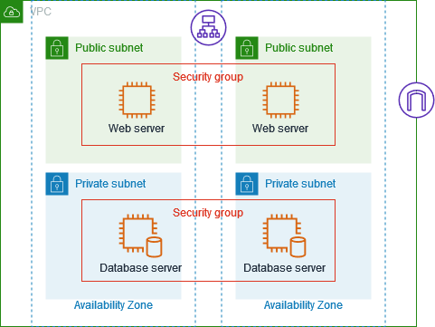
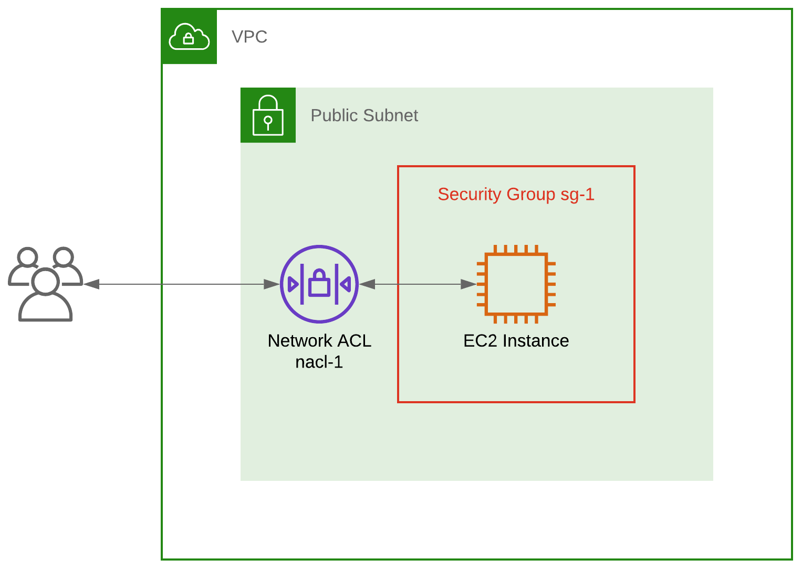
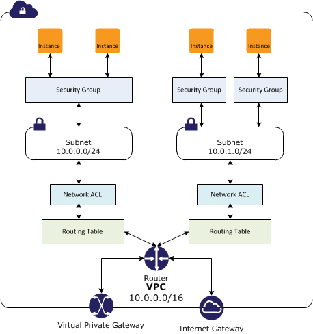

"title": "Security Group and Network ACLs",

## Understanding the Differences between Security Groups and Network Access Control Lists

Security groups and network access control lists (ACLs) are both important tools for securing your network on the AWS cloud, but they serve different purposes and have different use cases.

### Security Groups

Security groups can be compared to a bouncer at a club who controls the flow of traffic to and from your resources in a cloud computing environment. Imagine you have a club, and you want to ensure that only authorized individuals can enter and exit. In this analogy, the club represents your cloud resources (such as virtual machines or instances), and the bouncer represents the security group.

Just like a bouncer checks the IDs and credentials of people at the club's entrance, a security group examines the IP addresses and ports of incoming and outgoing network traffic. It acts as a virtual firewall that filters traffic based on predefined rules. These rules specify which types of traffic are allowed or denied.

For example, a security group can be configured to allow incoming HTTP traffic (on port 80) to a web server, but block all other types of incoming traffic. Similarly, it can permit outgoing traffic from the web server to external databases on a specific port, while restricting all other outbound connections.

By enforcing these rules, security groups act as a line of defense, helping to protect your resources from unauthorized access and malicious attacks. They ensure that only the traffic that meets the defined criteria is allowed to reach your resources, while blocking or rejecting any unauthorized or potentially harmful traffic.

It's important to note that security groups operate at the instance level, meaning they are associated with specific instances and can control traffic at a granular level. They can be customized and updated as needed to adapt to changing security requirements.

Overall, security groups provide an essential layer of security for your cloud resources by allowing you to define and manage access control policies, much like a bouncer regulates who can enter and exit a club.

### Network Access Control Lists {NACLs}

Network ACLs (Access Control Lists) can be likened to a security guard for a building, responsible for controlling inbound and outbound traffic at the subnet level in a cloud computing environment. Imagine you have a building with multiple rooms and entry points, and you want to ensure that only authorized individuals can enter and exit. In this analogy, the building represents your subnet, and the security guard represents the network ACL.

Similar to a security guard who verifies IDs and credentials before allowing entry into the building, a network ACL examines the IP addresses and ports of incoming and outgoing network traffic. It serves as a virtual barrier or perimeter security, defining rules that dictate which types of traffic are permitted or denied.

For instance, a network ACL can be configured to allow incoming SSH (Secure Shell) traffic (on port 22) to a specific subnet, while blocking all other types of incoming traffic. It can also permit outgoing traffic from the subnet to a specific range of IP addresses on a certain port, while disallowing any other outbound connections.

By implementing these rules, network ACLs act as a crucial line of defense, safeguarding your entire subnet from unauthorized access and malicious attacks. They ensure that only traffic meeting the specified criteria is allowed to enter or exit the subnet, while blocking or rejecting any unauthorized or potentially harmful traffic.

It's important to note that network ACLs operate at the subnet level, meaning they control traffic for all instances within a subnet. They provide a broader scope of security compared to security groups, which operate at the instance level. Network ACLs are typically stateless, meaning that inbound and outbound traffic is evaluated separately, and specific rules must be defined for both directions.

In summary, network ACLs function as a virtual security guard for your subnet, regulating inbound and outbound traffic at a broader level. They operate similarly to a security guard who controls access to a building by examining IDs, ensuring that only traffic meeting the defined rules is allowed to pass, and thereby providing protection against unauthorized access and malicious activities for your entire subnet.

## In conclusion 

In short, security groups and network ACLs are both important tools for securing your network on the AWS cloud, but they serve different purposes and have different use cases. Security groups are like a bouncer at a club, controlling inbound and outbound traffic to and from your resources at the individual resource level. Network ACLs, on the other hand, are like a security guard for a building, controlling inbound and outbound traffic at the subnet level.

