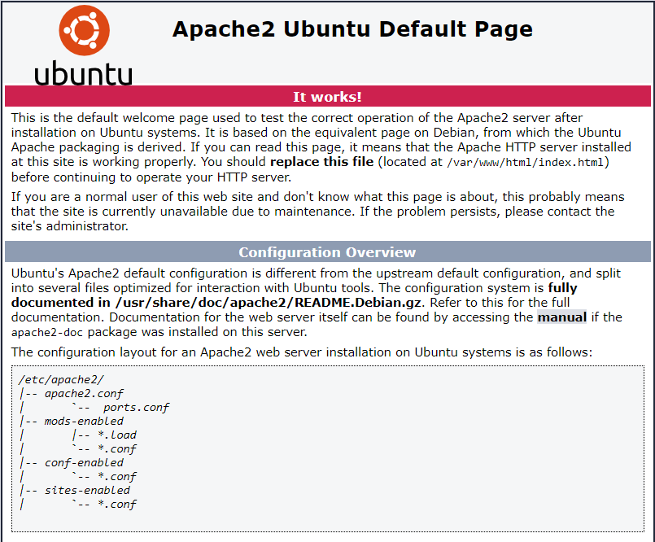

WEB STACK IMPLEMENTATION (LAMP STACK) IN AWS
============================================


#### Welcome to your very first PBL Project

You must be really excited to start getting your hands dirty. There is a lot of projects ahead, so without any delay, let's get started.

As you kick off your career in DevOps, you will soon realise that everything you will be doing as a DevOps engineer is around software, websites, applications etc. And, there are different stack of technologies that make different solutions possible. These stack of technologies are regarded as **WEB STACKS**. Examples of Web Stacks include **LAMP**, **LEMP**, **MEAN**, and **MERN** stacks. As you proceed in your journey, you will be required to understand and implement all of these technology stacks. Lets have a short close up on what a Technology stack is.

#### **What is a Technology stack?**

A technology stack is a set of frameworks and tools used to develop a software product. This set of frameworks and tools are very specifically chosen to work together in creating a well-functioning software. They are acronymns for individual technologies used together for a specific technology product. some examples are...

- **LAMP** (Linux, Apache, MySQL, PHP or Python, or Perl)
- **LEMP** (Linux, Nginx, MySQL, PHP or Python, or Perl)
- **MERN** (MongoDB, ExpressJS, ReactJS, NodeJS)
- **MEAN** (MongoDB, ExpressJS, AngularJS, NodeJS

**WARNING:** Most of the things you will be doing at the early days may not mean a lot to you. Sometimes it may seem like you are just copying and pasting. That is absolutely fine. We want some concepts to begin to register in your sub-conscious mind, and without you realising it, you are building up skills. although, there are certain traps that will require you to troubleshoot along the way. So watch out for them in all your project implementations.

#### After successful completion of **PBL** projects 1 to 4, you will be able to achieve the following. 

1. Become very confident on the Linux Terminal

2. Deepen your understanding of Web Stacks and familiarity between the differences between the different Web Technology stacks such as **LAMP**, **LEMP**, **MEAN**, and **MERN** stacks

3. Solid Linux administration skills in Storage management, NFS, troubleshooting, and basic networking.

4. Basic knowledge of AWS platform and components used to host a Website of various Web stacks.

Being able to work with Linux requires the ability to work outside the level of your present knowledge. It means that in the real world, you will be faced with tasks that you have never worked on before, and with **Google** search and its results, you can achieve a lot. Thanks to “**Google!!!**”. It is one of the essential skills you will need to develop - constructing a correct search query for Google to process and having the ability to comb through resources that interpretes into a potential solution for you is a great skill to have as well.


#### **Side Self Study** 

1. Conduct a Google search on what software development life cycle (SDLC) is and document your finding in a Google word file.
2. Conduct another Google search, understand what LAMP stack means.
3. Read about **_'chmod'_** and **_'chown'_** commands in Linux and understand how access and ownership of files and directories work.
4. Learn what TCP and UPD terms mean and how they are different. List down ports most commonly used in Web (http, https, ssh, telnet, ftp, sftp, telnet)
5. Get yourself familiar with basic text editing in [Vi (Vim)](https://www.vim.org) editor. [Practice here](https://www.openvim.com).

#### Instructions On How To Submit Your Work For Review And Feedback

To submit your work for review and feedback - follow [**this instruction**](https://starter-pbl.darey.io/en/latest/submission.html).

As a beginner it would be nice that you also set up your workspace for learning, you can take a look at these video series to learn how to do that/

- [windows-installation:Part1](https://youtu.be/R-qcpehB5HY)
- [windows-installation:Part2](https://youtu.be/jsNIlK5s6pI)

**IMPORTANT NOTE:** For Mac users you do not need to download windowes terminal as you already have a terminal by defualt
#### **Step 0 - Preparing prerequisites**

In order to complete this project you will need an AWS account and a virtual server with Ubuntu Server OS.

[AWS](https://aws.amazon.com) is the biggest Cloud Service Provider and it offers a free tier account that we are going to leverage for our projects.

Do not focus too much on AWS itself right now, there will be a proper Cloud introduction and configuration projects later in our course.

Right now, all we need to know is that AWS can provide us with a free virtual server called [EC2 (Elastic Compute Cloud)](https://aws.amazon.com/ec2/features/) for our needs.

Spinning up a new EC2 instance (an instance of a virtual server) is only a matter of a few clicks.

You can either Watch the videos below to get yourself set up.

1. [AWS account setup and Provisioning an Ubuntu Server](https://www.youtube.com/watch?v=xxKuB9kJoYM&list=PLtPuNR8I4TvkwU7Zu0l0G_uwtSUXLckvh&index=6)
2. [Connecting to your EC2 Instance](https://www.youtube.com/watch?v=TxT6PNJts-s&list=PLtPuNR8I4TvkwU7Zu0l0G_uwtSUXLckvh&index=7)

Or follow the instructions below. 
1. Register a new AWS account following [this instruction](https://aws.amazon.com/premiumsupport/knowledge-center/create-and-activate-aws-account/).
2. Select your preferred region (the closest to you) and launch a new EC2 instance of t2.micro family with Ubuntu Server 20.04 LTS (HVM)


***IMPORTANT*** - save your private key (.pem file) securely and do not share it with anyone! If you lose it, you will not be able to connect to your server ever again!


   
**IMPORTANT NOTICE** - 
    Both `Putty` and `ssh` use the [SSH protocol](https://en.wikipedia.org/wiki/SSH_(Secure_Shell)) to establish connectivity between computers. It is the most secure protocol because it uses crypto algorithms to encrypt the data that is transmitted - it uses TCP port **22** which is open for all newly created EC2 intances in AWS by default. Most of these terminologies will make more sense to you as you proceed. So for now, if nothing makes sense, just ignore. But be assured that the information is already registered in your sub-conscious mind. So it will become useful to you soon.

The process to connect to the virtual server is different between Windows and Mac. So lets take a quick tour.

(**Windows**) - Connecting to EC2 using Putty.

Remember the private key your downloaded from AWS while provisioning the server? It is a `PEM` file format. You can open it up to see the content and have a glimpse of what a `PEM` file looks like. 

Now, we are going to use that `PEM` key to connect to our EC2 Instnace via `ssh`.

On, windows the windows terminal tool is not installed by default, you can install it from [here](https://www.microsoft.com/en-us/p/windows-terminal/9n0dx20hk701?activetab=pivot:overviewtab)


```
cd Downloads
```

**IMPORTANT** - Anywhere you see these anchor tags **< >** , going forward, it means you will need to replace the content in there with values specific to your situation. For example, if we need you to replace the name you have saved the private key on your machine, we will write something like **< private-key-name >**. 

If the private key you downloaded was named **my-private-key.pem** simply remove the anchor tags and insert **my-private-key.pem** in the command you are required to execute. Lets try this and follow the instructions below to get some work done.


- Connect to the instance by running

```
ssh -i <private-key-name>.pem ubuntu@<Public-IP-address>
```

(**Macbook**) Connecting to EC2 using the terminal

- The terminal is already installed by default. You just need to open it up.
- You do not need to convert to a `.ppk` file. Just use the same key as downloaded from AWS.
- Change directory into the loacation where your `PEM` file is. Most likely will be in the **Downloads** folder

```
cd ~/Downloads
```

**IMPORTANT** - Anywhere you see these anchor tags **< >** , going forward, it means you will need to replace the content in there with values specific to your situation. For example, if we need you to replace the name you have saved the private key on your machine, we will write something like **< private-key-name >**. 

If the private key you downloaded was named **my-private-key.pem** simply remove the anchor tags and insert **my-private-key.pem** in the command you are required to execute. Lets try this and follow the instructions below to get some work done.

- Change premissions for the private key file (.pem), otherwise you can get an error "Bad permissions"

```
sudo chmod 0400 <private-key-name>.pem
```

- Connect to the instance by running

```
ssh -i <private-key-name>.pem ubuntu@<Public-IP-address>
```

Congratulations! You have just created your very first Linux Server in the Cloud and our set up looks like this now: (You are the client)


Please read information about AWS [free tier limits](https://aws.amazon.com/free/?all-free-tier.sort-by=item.additionalFields.SortRank&all-free-tier.sort-order=asc) and make sure that you ***STOP*** your EC2 instance when you are not using it. 


All we need to know right now is that we can use 750 hours (31.25 days) of t2.micro server per month for the first 12 months **FOR FREE**.

You can launch and stop new instances when you need to, but by default there is a soft-limit of maximum 5 running instances at the same time. In our first projects we will be using only 1 running instance at a time. When you stop an instance - it stops consuming available hours. 

Note that every time you stop and start your EC2 instance - you will have a **new IP address**, it is normal behavior, so do not forget to update your SSH credentials when you try to connect to your EC2 server.

Let us move on and configure our EC2 machine to serve a Web server!

####  Step 1 — Installing Apache and Updating the Firewall

What exactly is Apache? 

[Apache HTTP Server](https://httpd.apache.org) is the most widely used web server software. Developed and maintained by Apache Software Foundation, Apache is an open source software available for free. It runs on 67% of all webservers in the world. It is fast, reliable, and secure. It can be highly customized to meet the needs of many different environments by using extensions and modules. Most WordPress hosting providers use Apache as their web server software. However, websites and other applications can run on other web server software as well. Such as [Nginx](https://www.nginx.com), [Microsoft's IIS](https://www.iis.net), etc.

The Apache web server is among the most popular web servers in the world. It’s well documented, has an active community of users, and has been in wide use for much of the history of the web, which makes it a great default choice for hosting a website.

Install Apache using Ubuntu’s package manager [**_'apt'_**](https://en.wikipedia.org/wiki/APT_(software)):

```
#update a list of packages in package manager
$ sudo apt update
#run apache2 package installation
$ sudo apt install apache2
```
To verify that apache2 is running as a Service in our OS, use following command

```
$ sudo systemctl status apache2
```
If it is green and running, then you did everything correctly - you have just launched your first Web Server in the Clouds!

Before we can receive any traffic by our Web Server, we need to open TCP port 80 which is the default port that web browsers use to access web pages on the Internet

As we know, we have TCP port 22 open by default on our EC2 machine to access it via SSH, so we need to add a rule to EC2 configuration to open inbound connection through port 80:


Our server is running and we can access it locally and from the Internet (Source 0.0.0.0/0 means 'from any IP address').

First, let us try to check how we can access it locally in our Ubuntu shell, run:
```
$ curl http://localhost:80
or
$ curl http://127.0.0.1:80
```
These 2 commands above actually do pretty much the same - they use **_'curl'_** command to request our Apache HTTP Server on port 80 (actually you can even try to not specify any port - it will work anyway). The difference is that: in the first case we try to access our server via [DNS name](https://en.wikipedia.org/wiki/Domain_Name_System) and in the second one - by IP address (in this case IP address 127.0.0.1 corresponds to DNS name 'localhost' and the process of converting a DNS name to IP address is called "resolution"). We will touch DNS in further lectures and projects.

As an output you can see some strangely formatted test, do not worry, we just made sure that our Apache web service responds to 'curl' command with some payload.

Now it is time for us to test how our Apache HTTP server can respond to requests from the Internet.
Open a web browser of your choice and try to access following url

```
http://<Public-IP-Address>:80
```

Another way to retrieve your Public IP address, other than to check it in AWS Web console, is to use following command:

```
curl -s http://169.254.169.254/latest/meta-data/public-ipv4
```

The URL in browser shall also work if you do not specify port number since all web browsers use port 80 by default.

If you see following page, then your web server is now correctly installed and accessible through your firewall.



In fact, it is the same content that you previously got by 'curl' command, but represented in nice [HTML](https://en.wikipedia.org/wiki/HTML) formatting by your web browser.

#### Step 2 — Installing MySQL

Now that you have a web server up and running, you need to install a [Database Management System (DBMS)](https://en.wikipedia.org/wiki/Database#Database_management_system) to be able to store and manage data for your site in a [relational database](https://en.wikipedia.org/wiki/Relational_database). [MySQL](https://www.mysql.com) is a popular  relational database management system used within PHP environments, so we will use it in our project.

Again, use 'apt' to acquire and install this software:

```
$ sudo apt install mysql-server
```

When prompted, confirm installation by typing `Y`, and then `ENTER`.

When the installation is finished, log in to the MySQL console by typing:

```
$ sudo mysql
```

This will connect to the MySQL server as the administrative database user **root**, which is inferred by the use of sudo when running this command. You should see output like this:

```
Welcome to the MySQL monitor.  Commands end with ; or \g.
Your MySQL connection id is 11
Server version: 8.0.22-0ubuntu0.20.04.3 (Ubuntu)

Copyright (c) 2000, 2020, Oracle and/or its affiliates. All rights reserved.

Oracle is a registered trademark of Oracle Corporation and/or its
affiliates. Other names may be trademarks of their respective
owners.

Type 'help;' or '\h' for help. Type '\c' to clear the current input statement.

mysql> 
```

It’s recommended that you run a security script that comes pre-installed with MySQL. This script will remove some insecure default settings and lock down access to your database system. Before running the script you will set a password for the **root** user, using mysql_native_password as default authentication method. We’re defining this user’s password as `PassWord.1`.

```sql
ALTER USER 'root'@'localhost' IDENTIFIED WITH mysql_native_password BY 'PassWord.1';
```

Exit the MySQL shell with:

```sql
mysql> exit
```

Start the interactive script by running:

```
$ sudo mysql_secure_installation
```

This will ask if you want to configure the `VALIDATE PASSWORD PLUGIN`.

**Note**: Enabling this feature is something of a judgment call. If enabled, passwords which don’t match the specified criteria will be rejected by MySQL with an error. It is safe to leave validation disabled, but you should always use strong, unique passwords for database credentials.

Answer `Y` for yes, or anything else to continue without enabling.

```
VALIDATE PASSWORD PLUGIN can be used to test passwords
and improve security. It checks the strength of password
and allows the users to set only those passwords which are
secure enough. Would you like to setup VALIDATE PASSWORD plugin?

Press y|Y for Yes, any other key for No:
```

If you answer “yes”, you’ll be asked to select a level of password validation. Keep in mind that if you enter `2` for the strongest level, you will receive errors when attempting to set any password which does not contain numbers, upper and lowercase letters, and special characters, or which is based on common dictionary words e.g `PassWord.1`.

```sh
There are three levels of password validation policy:

LOW    Length >= 8
MEDIUM Length >= 8, numeric, mixed case, and special characters
STRONG Length >= 8, numeric, mixed case, special characters and dictionary              file

Please enter 0 = LOW, 1 = MEDIUM and 2 = STRONG: 1
```

Regardless of whether you chose to set up the `VALIDATE PASSWORD PLUGIN`, your server will next ask you to select and confirm a password for the MySQL **root** user. This is not to be confused with the **system root**. The **database root** user is an administrative user with full privileges over the database system. Even though the default authentication method for the MySQL root user dispenses the use of a password, **even when one is set**, you should define a strong password here as an additional safety measure. We’ll talk about this in a moment.

If you enabled password validation, you’ll be shown the password strength for the root password you just entered and your server will ask if you want to continue with that password. If you are happy with your current password, enter `Y` for “yes” at the prompt:

```
Estimated strength of the password: 100 
Do you wish to continue with the password provided?(Press y|Y for Yes, any other key for No) : y
```

For the rest of the questions, press `Y` and hit the `ENTER` key at each prompt. This will prompt you to change the root password, remove some anonymous users and the test database, disable remote root logins, and load these new rules so that MySQL immediately respects the changes you have made.

When you’re finished, test if you’re able to log in to the MySQL console by typing:

```
$ sudo mysql -p
```

Notice the `-p` flag in this command, which will prompt you for the password used after changing the **root** user password.

To exit the MySQL console, type:

```
mysql> exit
```

Notice that you need to provide a password to connect as the **root** user.

For increased security, it’s best to have dedicated user accounts with less expansive privileges set up for every database, especially if you plan on having multiple databases hosted on your server.

**Note**: At the time of this writing, the native MySQL PHP library `mysqlnd` doesn’t support `caching_sha2_authentication`, the default authentication method for MySQL 8. For that reason, when creating database users for PHP applications on MySQL 8, you’ll need to make sure they’re configured to use `mysql_native_password` instead.

Your MySQL server is now installed and secured. Next, we will install PHP, the final component in the LAMP stack.

#### Step 3 — Installing PHP

You have Apache installed to serve your content and MySQL installed to store and manage your data. [PHP](https://www.php.net) is the component of our setup that will process code to display dynamic content to the end user. In addition to the `php` package, you’ll need `php-mysql`, a PHP module that allows PHP to communicate with MySQL-based databases. You’ll also need `libapache2-mod-php` to enable Apache to handle PHP files. Core PHP packages will automatically be installed as dependencies.

To install these 3 packages at once, run:

```
$ sudo apt install php libapache2-mod-php php-mysql
```

Once the installation is finished, you can run the following command to confirm your PHP version:

```
php -v
```

```
PHP 7.4.3 (cli) (built: Oct  6 2020 15:47:56) ( NTS )
Copyright (c) The PHP Group
Zend Engine v3.4.0, Copyright (c) Zend Technologies
```

At this point, your LAMP stack is completely installed and fully operational.

- [x] **L**inux (Ubuntu)
- [x] **A**pache HTTP Server
- [x] **M**ySQL
- [x] **P**HP

To test your setup with a PHP script, it’s best to set up a proper [Apache Virtual Host](https://httpd.apache.org/docs/2.4/vhosts/) to hold your website’s files and folders. Virtual host allows you to have multiple websites located on a single machine and users of the websites will not even notice it.


We will configure our first Virtual Host in the next step.

#### Step 4 — Creating a Virtual Host for your Website using Apache

In this project, you will set up a domain called `projectlamp`, but you can replace this with any domain of your choice.

Apache on Ubuntu 20.04 has one server block enabled by default that is configured to serve documents from the **/var/www/html** directory.
We will leave this configuration as is and will add our own directory next next to the default one.

Create the directory for `projectlamp` using _**'mkdir'**_ command as follows:

```
$ sudo mkdir /var/www/projectlamp
```

Next, assign ownership of the directory with the `$USER` environment variable, which will reference your current system user:

```
$ sudo chown -R $USER:$USER /var/www/projectlamp
```

Then, create and open a new configuration file in Apache’s `sites-available` directory using your preferred command-line editor. Here, we’ll be using `vi` or `vim` (They are the same by the way):

```
$ sudo vi /etc/apache2/sites-available/projectlamp.conf
```

This will create a new blank file. Paste in the following bare-bones configuration by hitting on `i` on the keyboard to enter the insert mode, and paste the text:

```
<VirtualHost *:80>
    ServerName projectlamp
    ServerAlias www.projectlamp 
    ServerAdmin webmaster@localhost
    DocumentRoot /var/www/projectlamp
    ErrorLog ${APACHE_LOG_DIR}/error.log
    CustomLog ${APACHE_LOG_DIR}/access.log combined
</VirtualHost>
```

To save and close the file, simply follow the steps below:

1. Hit the `esc` button on the keyboard
2. Type `:` 
3. Type `wq`. **w** for `write` and **q** for `quit`
4. Hit `ENTER` to save the file

You can use the **_`ls`_** command to show the new file in the **sites-available** directory

```
$ sudo ls /etc/apache2/sites-available
You will see something like this
000-default.conf  default-ssl.conf  projectlamp.conf
```

With this VirtualHost configuration, we’re telling Apache to serve `projectlamp` using **/var/www/projectlampl** as its web root directory. If you would like to test Apache without a domain name, you can remove or comment out the options ServerName and ServerAlias by adding a **#** character in the beginning of each option’s lines. Adding the **#** character there will tell the program to skip processing the instructions on those lines.

You can now use **_a2ensite_** command to enable the new virtual host:

```
$ sudo a2ensite projectlamp
```

You might want to disable the default website that comes installed with Apache. This is required if you’re not using a custom domain name, because in this case Apache’s default configuration would overwrite your virtual host. To disable Apache’s default website use **_a2dissite_** command , type:

```
$ sudo a2dissite 000-default
```

To make sure your configuration file doesn’t contain syntax errors, run:

```
$ sudo apache2ctl configtest
```

Finally, reload Apache so these changes take effect:

```
$ sudo systemctl reload apache2
```

Your new website is now active, but the web root **/var/www/projectlamp** is still empty. Create an index.html file in that location so that we can test that the virtual host works as expected:

```
sudo echo 'Hello LAMP from hostname' $(curl -s http://169.254.169.254/latest/meta-data/public-hostname) 'with public IP' $(curl -s http://169.254.169.254/latest/meta-data/public-ipv4) > /var/www/projectlamp/index.html
```

Now go to your browser and try to open your website URL using IP address:

```
http://<Public-IP-Address>:80
```

If you see the text from **_'echo'_** command you wrote to index.html file, then it means your Apache virtual host is working as expected.
In the output you will see your server's public hostname (DNS name) and public IP address. You can also access your website in your browser by public DNS name, not only by IP - try it out, the result must be the same (port is optional)

```
http://<Public-DNS-Name>:80
```

You can leave this file in place as a temporary landing page for your application until you set up an `index.php` file to replace it. Once you do that, remember to remove or rename the `index.html` file from your document root, as it would take precedence over an `index.php` file by default.


#### Step 5 — Enable PHP on the website

With the default **DirectoryIndex** settings on Apache, a file named `index.html` will always take precedence over an `index.php` file. This is useful for setting up maintenance pages in PHP applications, by creating a temporary `index.html` file containing an informative message to visitors. Because this page will take precedence over the `index.php` page, it will then become the landing page for the application. Once maintenance is over, the `index.html` is renamed or removed from the document root, bringing back the regular application page.

In case you want to change this behavior, you’ll need to edit the **/etc/apache2/mods-enabled/dir.conf** file and change the order in which the **index.php** file is listed within the **DirectoryIndex** directive:

```
sudo vim /etc/apache2/mods-enabled/dir.conf
```

```
<IfModule mod_dir.c>
        #Change this:
        #DirectoryIndex index.html index.cgi index.pl index.php index.xhtml index.htm
        #To this:
        DirectoryIndex index.php index.html index.cgi index.pl index.xhtml index.htm
</IfModule>
```

After saving and closing the file, you will need to reload Apache so the changes take effect:

```
$ sudo systemctl reload apache2
```

Finally, we will create a PHP script to test that PHP is correctly installed and configured on your server.

Now that you have a custom location to host your website’s files and folders, we’ll create a PHP test script to confirm that Apache is able to handle and process requests for PHP files.

Create a new file named `index.php` inside your custom web root folder:

```
$ vim /var/www/projectlamp/index.php
```

This will open a blank file. Add the following text, which is valid PHP code, inside the file:

```
<?php
phpinfo();
```

When you are finished, save and close the file, refresh the page and you will see a page similar to this:


This page provides information about your server from the perspective of PHP. It is useful for debugging and to ensure that your settings are being applied correctly.

If you can see this page in your browser, then your PHP installation is working as expected.

After checking the relevant information about your PHP server through that page, it’s best to remove the file you created as it contains sensitive information about your PHP environment -and your Ubuntu server. You can use `rm` to do so:

```
$ sudo rm /var/www/projectlamp/index.php
```

You can always recreate this page if you need to access the information again later.

Credit: [This guide was inspired by Digital Ocean](https://www.digitalocean.com/community/tutorials/how-to-install-linux-apache-mysql-php-lamp-stack-on-ubuntu-20-04#step-3-%E2%80%94-installing-php)

Congratulations, You have finished your very first **REAL LIFE PROJECT** by deploying a LAMP stack website in AWS Cloud!


