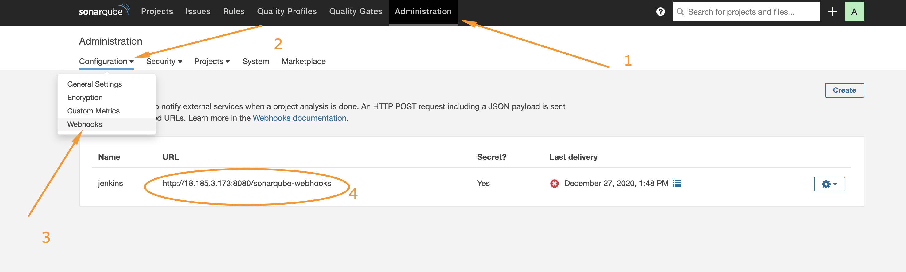

### Configure SonarQube and Jenkins For Quality Gate

- In Jenkins, install [SonarScanner plugin](https://docs.sonarqube.org/latest/analysis/scan/sonarscanner-for-jenkins/) 
- Navigate to configure system in Jenkins. Add SonarQube server as shown below:
  ```
  Manage Jenkins > Configure System
  ```
  
- Generate authentication token in SonarQube 
  ```
  User > My Account > Security > Generate Tokens
  ```
  
- Configure Quality Gate Jenkins Webhook in SonarQube - The URL should point to your Jenkins server http://{JENKINS_HOST}/sonarqube-webhook/
  ```
  Administration > Configuration > Webhooks > Create
  ```
  

- Setup SonarQube scanner from Jenkins - Global Tool Configuration
  ```
  Manage Jenkins > Global Tool Configuration 
  ```
  

### Update Jenkins Pipeline to include SonarQube scanning and Quality Gate

Below is the snippet for a **Quality Gate** stage in `Jenkinsfile`. 

```
    stage('SonarQube Quality Gate') {
        environment {
            scannerHome = tool 'SonarQubeScanner'
        }
        steps {
            withSonarQubeEnv('sonarqube') {
                sh "${scannerHome}/bin/sonar-scanner"
            }

        }
    }
```

**NOTE:** The above step will fail because we have not updated `sonar-scanner.properties

- Configure `sonar-scanner.properties` - From the step above, Jenkins will install the scanner tool on the Linux server. You will need to go into the `tools` directory on the server to configure the `properties` file in which SonarQube will require to function during pipeline execution.

```
cd /var/lib/jenkins/tools/hudson.plugins.sonar.SonarRunnerInstallation/SonarQubeScanner/conf/
```

Open `sonar-scanner.properties` file 
```
sudo vi sonar-scanner.properties
```
Add configuration related to `php-todo` project
```
sonar.host.url=http://<SonarQube-Server-IP-address>:9000
sonar.projectKey=php-todo
#----- Default source code encoding
sonar.sourceEncoding=UTF-8
sonar.php.exclusions=**/vendor/**
sonar.php.coverage.reportPaths=build/logs/clover.xml
sonar.php.tests.reportPath=build/logs/junit.xml
```

**HINT**: To know what exactly to put inside the `sonar-scanner.properties` file, SonarQube has a configurations page where you can get some directions.


A brief explanation of what is going on the the stage - set the environment variable for the `scannerHome` use the same name used when you configured SonarQube Scanner from **Jenkins Global Tool Configuration**. If you remember, the name was `SonarQubeScanner`. Then, within the `steps` use shell to run the scanner from `bin` directory. 

To further examine the configuration of the scanner tool on the Jenkins server - navigate into the `tools` directory

```
cd /var/lib/jenkins/tools/hudson.plugins.sonar.SonarRunnerInstallation/SonarQubeScanner/bin
```

List the content to see the scanner tool `sonar-scanner`. That is what we are calling in the pipeline script.

Output of `ls -latr`
```
ubuntu@ip-172-31-16-176:/var/lib/jenkins/tools/hudson.plugins.sonar.SonarRunnerInstallation/SonarQubeScanner/bin$ ls -latr
total 24
-rwxr-xr-x 1 jenkins jenkins 2550 Oct  2 12:42 sonar-scanner.bat
-rwxr-xr-x 1 jenkins jenkins  586 Oct  2 12:42 sonar-scanner-debug.bat
-rwxr-xr-x 1 jenkins jenkins  662 Oct  2 12:42 sonar-scanner-debug
-rwxr-xr-x 1 jenkins jenkins 1823 Oct  2 12:42 sonar-scanner
drwxr-xr-x 2 jenkins jenkins 4096 Dec 26 18:42 .
```

So far you have been given code snippets on each of the stages within the `Jenkinsfile`. But, you should also be able to generate Jenkins configuration code yourself.

- To generate Jenkins code, navigate to the dashboard for the `php-todo` pipeline and click on the **Pipeline Syntax** menu item

```
Dashboard > php-todo > Pipeline Syntax 
```


- Click on Steps and select `withSonarQubeEnv` - This appears in the list because of the previous SonarQube configurations you have done in Jenkins. Otherwise, it would not be there.


Within the generated block, you will use the `sh` command to run shell on the server. For more advanced usage in other projects, you can add to bookmarks this [SonarQube documentation page](https://docs.sonarqube.org/latest/analysis/scan/sonarscanner-for-jenkins/) in your browser.

### End-to-End Pipeline Overview

Indeed, this has been one of the longest projects from Project 1, and if everything has worked out for you so far, you should have a view like below:


But we are not completely done yet!

The quality gate we just included has no effect. Why? Well, because if you go to the SonarQube UI, you will realise that we just pushed a poor-quality code onto the development environment. 

- Navigate to `php-todo` project in SonarQube


There are bugs, and there is 0.0% code coverage. (*code coverage is a percentage of unit tests added by developers to test functions and objects in the code*)

- If you click on `php-todo` project for further analysis, you will see that there is 6 hours' worth of technical debt, code smells and security issues in the code.


In the development environment, this is acceptable as developers will need to keep iterating over their code towards perfection. But as a DevOps engineer working on the pipeline, we must ensure that the quality gate step causes the pipeline to fail if the conditions for quality are not met.

### Conditionally deploy to higher environments

In the real world, developers will work on feature branch in a repository (e.g., GitHub or GitLab). There are other branches that will be used differently to control how software releases are done. You will see such branches as:

- Develop
- Master or Main
  (The `*` is a place holder for a version number, Jira Ticket name or some description. It can be something like `Release-1.0.0`)
- Feature/*
- Release/* 
- Hotfix/*

etc.

There is a very wide discussion around release strategy, and git branching strategies which in recent years are considered under what is known as [GitFlow](https://www.atlassian.com/git/tutorials/comparing-workflows/gitflow-workflow) (Have a read and keep as a bookmark - it is a possible candidate for an interview discussion, so take it seriously!)

Assuming a basic `gitflow` implementation restricts only the `develop` branch to deploy code to Integration environment like `sit`. 

Let us update our `Jenkinsfile` to implement this:

- First, we will include a `When` condition to run Quality Gate whenever the running branch is either `develop`, `hotfix`, `release`, `main`, or `master` 

```
when { branch pattern: "^develop*|^hotfix*|^release*|^main*", comparator: "REGEXP"}
```

- Then we add a timeout step to wait for SonarQube to complete analysis and successfully finish the pipeline only when code quality is acceptable.

```
    timeout(time: 1, unit: 'MINUTES') {
        waitForQualityGate abortPipeline: true
    }
```

The complete stage will now look like this:

```
    stage('SonarQube Quality Gate') {
      when { branch pattern: "^develop*|^hotfix*|^release*|^main*", comparator: "REGEXP"}
        environment {
            scannerHome = tool 'SonarQubeScanner'
        }
        steps {
            withSonarQubeEnv('sonarqube') {
                sh "${scannerHome}/bin/sonar-scanner -Dproject.settings=sonar-project.properties"
            }
            timeout(time: 1, unit: 'MINUTES') {
                waitForQualityGate abortPipeline: true
            }
        }
    }
```

To test, create different branches and push to GitHub. You will realise that only branches other than `develop`, `hotfix`, `release`, `main`, or `master` will be able to deploy the code.

If everything goes well, you should be able to see something like this:


Notice that with the current state of the code, it cannot be deployed to Integration environments due to its quality. In the real world, DevOps engineers will push this back to developers to work on the code further, based on SonarQube quality report. Once everything is good with code quality, the pipeline will pass and proceed with sipping the codes further to a higher environment.

## Complete the following tasks to finish Project 14

1. Introduce Jenkins agents/slaves - Add 2 more servers to be used as Jenkins slave. Configure Jenkins to run its pipeline jobs randomly on any available slave nodes.
3. Configure webhook between Jenkins and GitHub to automatically run the pipeline when there is a code push. 
4. Deploy the application to all the environments
5. **Optional** - Experience pentesting in pentest environment by configuring [Wireshark](https://www.wireshark.org) there and just explore for information sake only. [Watch Wireshark Tutorial here](https://youtu.be/Yo8zGbCbqd0) 
 - Ansible Role for Wireshark:
   - https://github.com/ymajik/ansible-role-wireshark (Ubuntu) 
   - https://github.com/wtanaka/ansible-role-wireshark (RedHat) 


Congratulations! You have just experienced one of the most interesting and complex projects in your Project Based Learning journey so far. The vast experience and knowledge you have acquired here will set the stage for the next 6 projects to come. You should be ready to start applying for DevOps jobs after completing Project 20.


#### Instructions On How To Submit Your Work For Review And Feedback

To submit your work for review and feedback - follow [**this instruction**](https://starter-pbl.darey.io/en/latest/submission.html).
In addition to your GitHub projects (both, Ansible and PHP application) also prepare and submit the following:

1. Make a short video on how your pipelines have executed 
2. In the video, showcase your SonarQube UI
