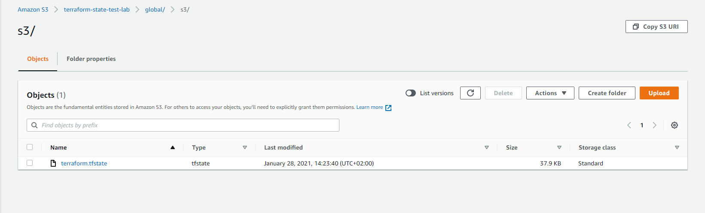
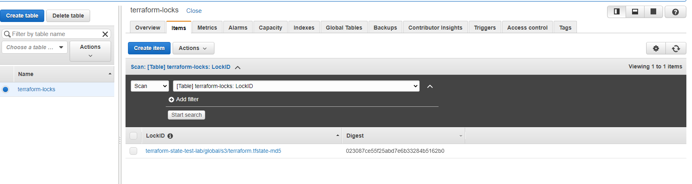
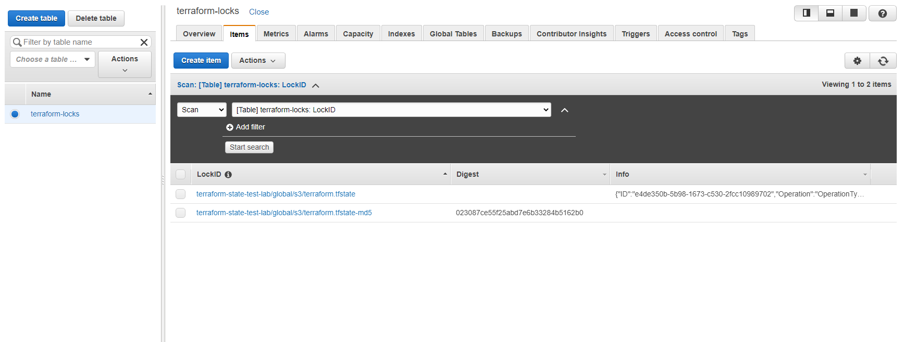
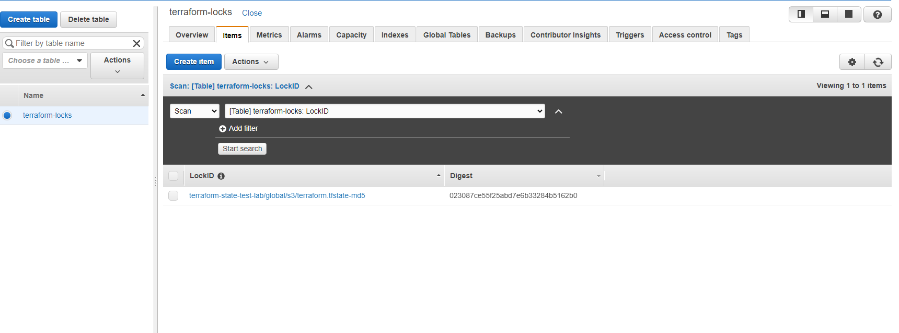
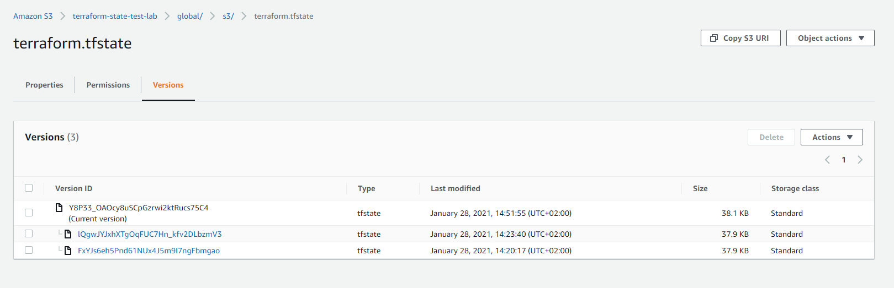

1. Create a file and name it `backend.tf`. Add the below code and replace the name of the S3 bucket you created in [Project-16](https://expert-pbl.darey.io/en/latest/project16.html).

```
# Note: The bucket name may not work for you since buckets are unique globally in AWS, so you must give it a unique name.
resource "aws_s3_bucket" "terraform_state" {
  bucket = "dev-terraform-bucket"
  # Enable versioning so we can see the full revision history of our state files
  versioning {
    enabled = true
  }
  # Enable server-side encryption by default
  server_side_encryption_configuration {
    rule {
      apply_server_side_encryption_by_default {
        sse_algorithm = "AES256"
      }
    }
  }
}
```

You must be aware that Terraform stores secret data inside the state files. Passwords, and secret keys processed by resources are always stored in there. Hence, you must consider to always enable encryption. You can see how we achieved that with [`server_side_encryption_configuration`](https://docs.aws.amazon.com/AmazonS3/latest/userguide/serv-side-encryption.html).

2. Next, we will create a DynamoDB table to handle locks and perform consistency checks. In previous projects, locks were handled with a local file as shown in `terraform.tfstate.lock.info`. Since we now have a team mindset, causing us to configure S3 as our backend to store state file, we will do the same to handle locking. Therefore, with a cloud storage database like DynamoDB, anyone running Terraform against the same infrastructure can use a central location to control a situation where Terraform is running at the same time from multiple different people.

Dynamo DB resource for locking and consistency checking:

```
resource "aws_dynamodb_table" "terraform_locks" {
  name         = "terraform-locks"
  billing_mode = "PAY_PER_REQUEST"
  hash_key     = "LockID"
  attribute {
    name = "LockID"
    type = "S"
  }
}
```

Terraform expects that both S3 bucket and DynamoDB resources are already created before we configure the backend. So, let us run `terraform apply` to provision resources.

3. Configure S3 Backend

```
terraform {
  backend "s3" {
    bucket         = "dev-terraform-bucket"
    key            = "global/s3/terraform.tfstate"
    region         = "eu-central-1"
    dynamodb_table = "terraform-locks"
    encrypt        = true
  }
}
```
Now its time to re-initialize the backend. Run `terraform init` and confirm you are happy to change the backend by typing `yes`

4. Verify the changes

Before doing anything if you opened AWS now to see what happened you should be able to see the following:
- `.tfstatefile` is now inside the S3 bucket 



- DynamoDB table which we create has an entry which includes state file status 



Navigate to the DynamoDB table inside AWS and leave the page open in your browser.  Run `terraform plan` and while that is running, refresh the browser and see how the lock is being handled:



After `terraform plan` completes, refresh DynamoDB table. 




5. Add Terraform Output

Before you run `terraform apply` let us add an output so that the S3 bucket [Amazon Resource Names ARN](https://docs.aws.amazon.com/general/latest/gr/aws-arns-and-namespaces.html) and DynamoDB table name can be displayed. 

Create a new file and name it `output.tf` and add below code.

```
output "s3_bucket_arn" {
  value       = aws_s3_bucket.terraform_state.arn
  description = "The ARN of the S3 bucket"
}
output "dynamodb_table_name" {
  value       = aws_dynamodb_table.terraform_locks.name
  description = "The name of the DynamoDB table"
}
```

Now we have everything ready to go!

6. Let us run `terraform apply`

Terraform will automatically read the latest state from the S3 bucket to determine the current state of the infrastructure. Even if another engineer has applied changes, the state file will always be up to date.

Now, head over to the S3 console again, refresh the page, and click the grey “Show” button next to “Versions.” You should now see several versions of your terraform.tfstate file in the S3 bucket:



With help of remote backend and locking configuration that we have just configured, collaboration is no longer a problem.

However, there is still one more problem: **Isolation Of Environments**. Most likely we will need to create resources for different environments, such as: `Dev`, `sit`, `uat`, `preprod`, `prod`, etc. 

This separation of environments can be achieved using one of two methods:

a. [**Terraform Workspaces**](https://www.terraform.io/docs/language/state/workspaces.html)
b. **Directory** based separation using `terraform.tfvars` file
