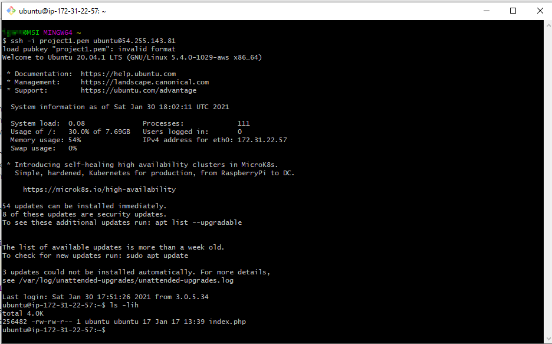

WEB STACK IMPLEMENTATION (LEMP STACK)
=====================================


#### Project 2 covers similar concepts as [Project 1](https://starter-pbl.darey.io/en/latest/project1.html) and helps to cement your skills of deploying Web solutions using LA(E)MP stacks. 

You have done a great job with successful completion of Project 1. 

In this project you will implement a similar stack, but with an alternative Web Server - [NGINX](https://nginx.org/en/), which is also very popular and widely used by many websites in the Internet.

#### Side Self Study

1. Make yourself familiar with basic [SQL syntax and most commonly used commands](https://www.w3schools.com/sql/sql_syntax.asp)
2. Be comfortable using not only VIM, but also [Nano editor](https://www.nano-editor.org) as well, get to know [basic Nano commands](http://www.linuxandubuntu.com/home/nano-cli-text-editor-for-everyone-basic-tutorials)

#### Instructions On How To Submit Your Work For Review And Feedback

To submit your work for review and feedback - follow [**this instruction**](https://starter-pbl.darey.io/en/latest/submission.html).

#### Step 0 - Preparing prerequisites

In order to complete this project you will need an AWS account and a virtual server with Ubuntu Server OS.

If you do not have an AWS account - go back to **[Project 1 Step 0](https://starter-pbl.darey.io/en/latest/project1.html)** to sign in to AWS free tier account and create a new EC2 Instance of t2.micro family with Ubuntu Server 22.04 LTS (HVM) image. Remember, you can have multiple EC2 instances, but make sure you **STOP** the ones you are not working with at the moment to save available free hours.

**Hint:** In previous project we used Putty on Windows to connect to our EC2 Instance, but there is a simpler way that do not require conversion of **.pem** key to **.ppk** - using [Git Bash](https://git-scm.com/downloads). 

Download and install Git Bash like it is shown in [this video](https://youtu.be/qdwWe9COT9k).

Launch Git Bash and run following command:

```
ssh -i <Your-private-key.pem> ubuntu@<EC2-Public-IP-address>
```

It will look like this:




