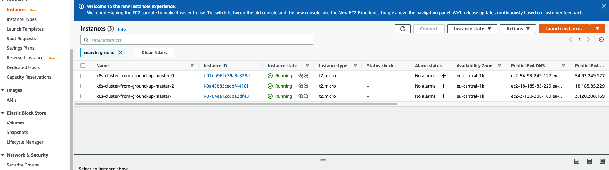
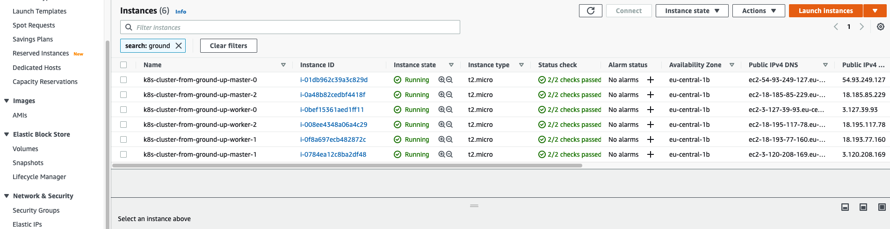

#### Step 2 - Create Compute Resources 

**AMI**

1. Get an image to create EC2 instances:

```
IMAGE_ID=$(aws ec2 describe-images --owners 099720109477 \
  --filters \
  'Name=root-device-type,Values=ebs' \
  'Name=architecture,Values=x86_64' \
  'Name=name,Values=ubuntu/images/hvm-ssd/ubuntu-xenial-16.04-amd64-server-*' \
  | jq -r '.Images|sort_by(.Name)[-1]|.ImageId')
```

**SSH key-pair**

2. Create SSH Key-Pair
   
```
mkdir -p ssh

aws ec2 create-key-pair \
  --key-name ${NAME} \
  --output text --query 'KeyMaterial' \
  > ssh/${NAME}.id_rsa
chmod 600 ssh/${NAME}.id_rsa
```

**EC2 Instances for Controle Plane (Master Nodes)**

3. Create 3 Master nodes: **Note** - Using `t2.micro` instead of `t2.small` as `t2.micro` is covered by AWS free tier

```
for i in 0 1 2; do
  instance_id=$(aws ec2 run-instances \
    --associate-public-ip-address \
    --image-id ${IMAGE_ID} \
    --count 1 \
    --key-name ${NAME} \
    --security-group-ids ${SECURITY_GROUP_ID} \
    --instance-type t2.micro \
    --private-ip-address 172.31.0.1${i} \
    --user-data "name=master-${i}" \
    --subnet-id ${SUBNET_ID} \
    --output text --query 'Instances[].InstanceId')
  aws ec2 modify-instance-attribute \
    --instance-id ${instance_id} \
    --no-source-dest-check
  aws ec2 create-tags \
    --resources ${instance_id} \
    --tags "Key=Name,Value=${NAME}-master-${i}"
done
```



**EC2 Instances for Worker Nodes**

1. Create 3 worker nodes:

```
for i in 0 1 2; do
  instance_id=$(aws ec2 run-instances \
    --associate-public-ip-address \
    --image-id ${IMAGE_ID} \
    --count 1 \
    --key-name ${NAME} \
    --security-group-ids ${SECURITY_GROUP_ID} \
    --instance-type t2.micro \
    --private-ip-address 172.31.0.2${i} \
    --user-data "name=worker-${i}|pod-cidr=172.20.${i}.0/24" \
    --subnet-id ${SUBNET_ID} \
    --output text --query 'Instances[].InstanceId')
  aws ec2 modify-instance-attribute \
    --instance-id ${instance_id} \
    --no-source-dest-check
  aws ec2 create-tags \
    --resources ${instance_id} \
    --tags "Key=Name,Value=${NAME}-worker-${i}"
done
```


#### Step 3 Prepare The Self-Signed Certificate Authority And Generate TLS Certificates

The following components running on the Master node will require TLS certificates.

- kube-controller-manager
- kube-scheduler
- etcd
- kube-apiserver
- kubelet
- kube-proxy

The following components running on the Worker nodes will require TLS certificates.

- kubelet
- kube-proxy

Therefore, you will provision a **PKI** Infrastructure using `cfssl` which will have a Certificate Authority. The CA will then generate certificates for all the individual components.

**Self-Signed Root Certificate Authority (CA)**

Here, you will provision a CA that will be used to sign additional TLS certificates. 

Create a directory and `cd` into it:

```
mkdir ca-authority && cd ca-authority
```

Generate the CA configuration file, Root Certificate, and Private key:

```
{

cat > ca-config.json <<EOF
{
  "signing": {
    "default": {
      "expiry": "8760h"
    },
    "profiles": {
      "kubernetes": {
        "usages": ["signing", "key encipherment", "server auth", "client auth"],
        "expiry": "8760h"
      }
    }
  }
}
EOF

cat > ca-csr.json <<EOF
{
  "CN": "Kubernetes",
  "key": {
    "algo": "rsa",
    "size": 2048
  },
  "names": [
    {
      "C": "UK",
      "L": "England",
      "O": "Kubernetes",
      "OU": "DAREY.IO DEVOPS",
      "ST": "London"
    }
  ]
}
EOF

cfssl gencert -initca ca-csr.json | cfssljson -bare ca

}
```

The file defines the following:

```
CN – Common name for the authority

algo – the algorithm used for the certificates

size – algorithm size in bits

C – Country

L – Locality (city)

ST – State or province

O – Organization

OU – Organizational Unit
```

**Output:**

```
2021/05/16 20:18:44 [INFO] generating a new CA key and certificate from CSR
2021/05/16 20:18:44 [INFO] generate received request
2021/05/16 20:18:44 [INFO] received CSR
2021/05/16 20:18:44 [INFO] generating key: rsa-2048
2021/05/16 20:18:44 [INFO] encoded CSR
2021/05/16 20:18:44 [INFO] signed certificate with serial number 478642753175858256977534824638605235819766817855
```

List the directory to see the created files

```
ls -ltr

-rw-r--r--  1 dare  dare   232 16 May 20:18 ca-config.json
-rw-r--r--  1 dare  dare   207 16 May 20:18 ca-csr.json
-rw-r--r--  1 dare  dare  1306 16 May 20:18 ca.pem
-rw-------  1 dare  dare  1679 16 May 20:18 ca-key.pem
-rw-r--r--  1 dare  dare  1001 16 May 20:18 ca.csr
```

The 3 important files here are:

- **ca.pem** - The Root Certificate
- **ca-key.pem** - The Private Key
- **ca.csr** - The Certificate Signing Request