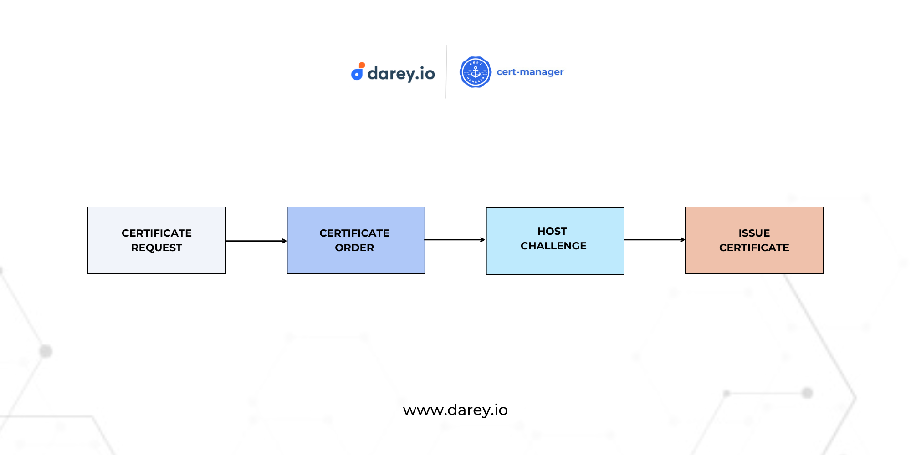
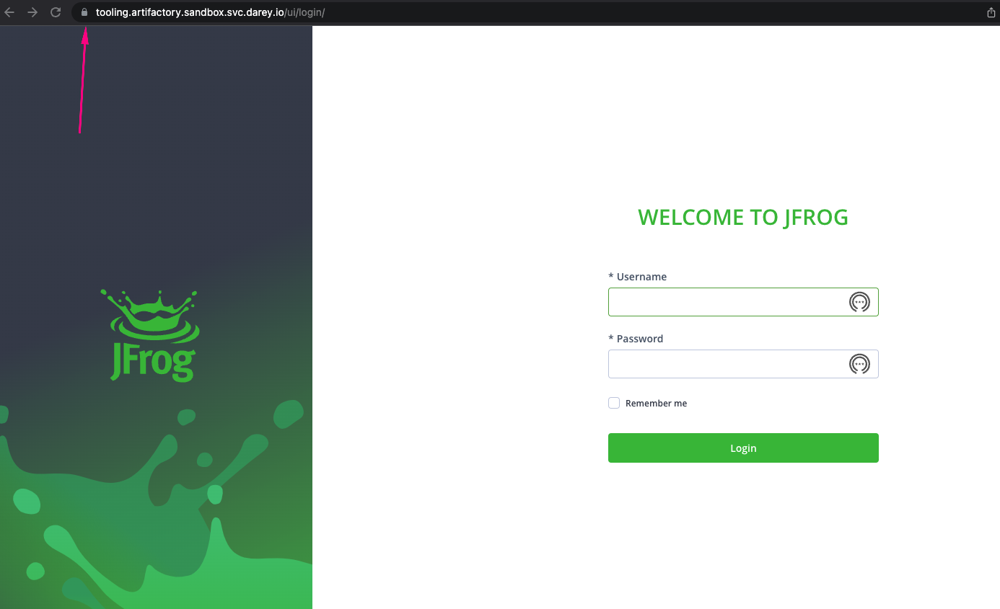
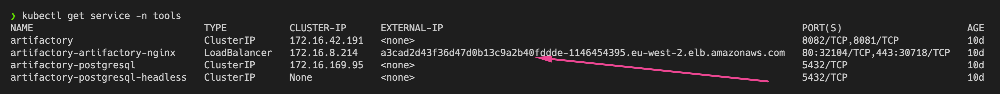
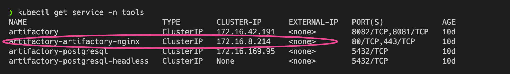
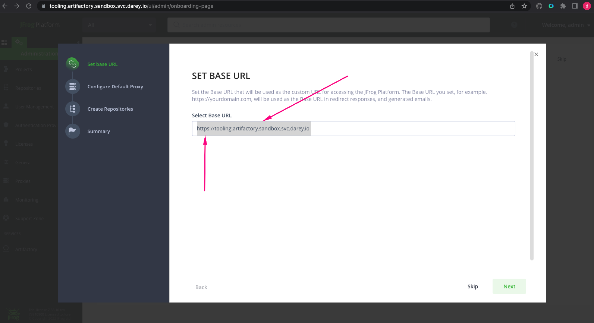
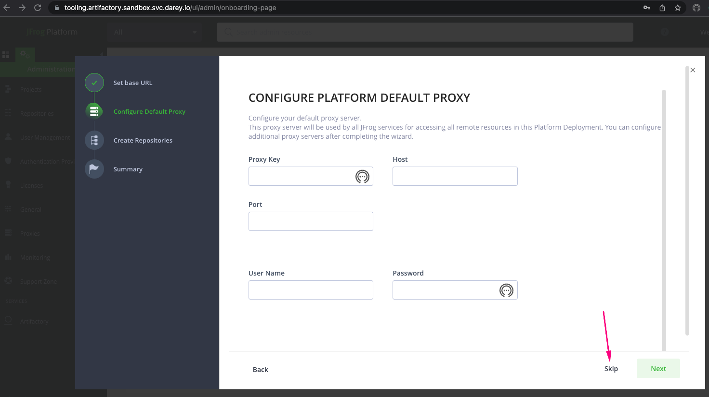
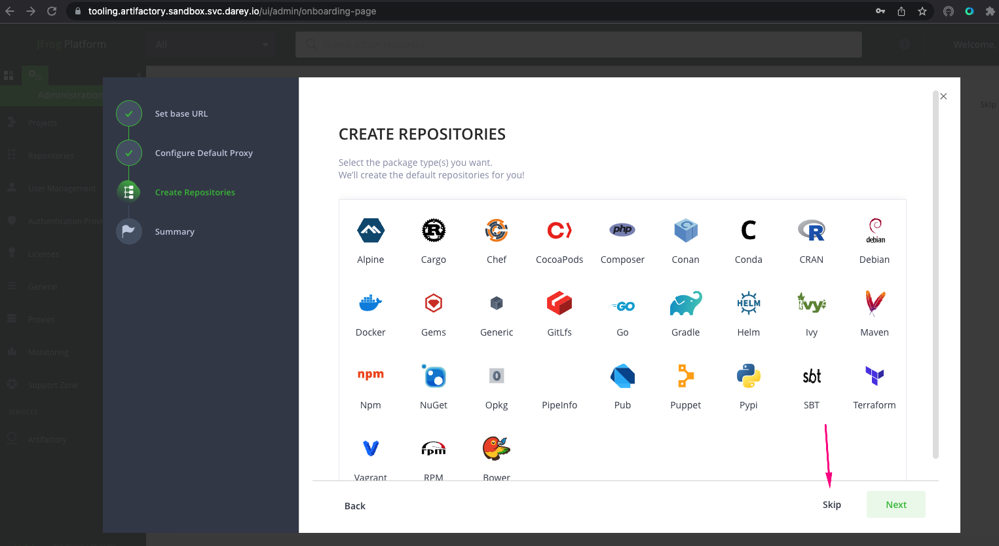

Configuring Ingress for TLS
========================================================

To ensure that every created ingress also has TLS configured, we will need to update the ingress manifest with TLS specific configurations.

```
apiVersion: networking.k8s.io/v1
kind: Ingress
metadata:
  annotations:
    cert-manager.io/cluster-issuer: "letsencrypt-prod"
    kubernetes.io/ingress.class: nginx
  name: artifactory
spec:
  rules:
  - host: "tooling.artifactory.sandbox.svc.darey.io"
    http:
      paths:
      - path: /
        pathType: Prefix
        backend:
          service:
            name: artifactory
            port:
              number: 8082
  tls:
  - hosts:
    - "tooling.artifactory.sandbox.svc.darey.io"
    secretName: "tooling.artifactory.sandbox.svc.darey.io"
```

The most significat updates to the ingress definition is the `annotations` and `tls` sections.

Lets quickly talk about Annotations. **Annotations** are used similar to `labels` in kubernetes. They are ways to attach metadata to objects.

## Differences between Annotations and Labels

**Labels** are used in conjunction with selectors to identify groups of related resources. Because selectors are used to query labels, this operation needs to be efficient. To ensure efficient queries, labels are constrained by RFC 1123. RFC 1123, among other constraints, restricts labels to a maximum 63 character length. Thus, labels should be used when you want Kubernetes to group a set of related resources.

**Annotations** are used for “non-identifying information” i.e., metadata that Kubernetes does not care about. As such, annotation keys and values have no constraints. Thus, if you want to add information for other humans about a given resource, then annotations are a better choice.

The Annotation added to the Ingress resource adds metadata to specify the issuer responsible for requesting certificates. The issuer here will be the same one we have created earlier with the name`letsencrypt-prod`. 
```
  annotations:
    cert-manager.io/cluster-issuer: "letsencrypt-prod"
```

The other section is `tls` where the host name that will require `https` is specified. The `secretName` also holds the name of the secret that will be created which will store details of the certificate key-pair. i.e Private key and public certificate. 


```
  tls:
  - hosts:
    - "tooling.artifactory.sandbox.svc.darey.io"
    secretName: "tooling.artifactory.sandbox.svc.darey.io"
```

Redeploying the newly updated ingress will go through the process as shown below.



Once deployed, you can run the following commands to see each resource at each phase.

- kubectl get certificaaterequest
- kubectl get order
- kubectl get challenge 
-  kubectl get certificate

At each stage you can run **describe** on each resource to get more information on what cert-manager is doing.

If all goes well, running `kubectl get certificate`,you should see an output like below.

```
NAME                                           READY                            SECRET                          AGE
tooling.artifactory.sandbox.svc.darey.io       True             tooling.artifactory.sandbox.svc.darey.io       108s
```

Notice the secret name there in the above output.  Executing the command `kubectl get secrettooling.artifactory.sandbox.svc.darey.io -o yaml`, you will see the `data` with encoded version of both the private key `tls.key` and the public certificate `tls.crt`. This is the actual certificate configuration that the ingress controller will use as part of Nginx configuration to terminate TLS/SSL on the ingress.

If you now head over to the browser, you should see the padlock sign without warnings of untrusted certificates.



Finally, one more task for you to do is to ensure that the LoadBalancer created for artifactory is destroyed. If you run a get service kubectl command like below;

```
kubectl get service -n tools
```


You will see that the load balancer is still there. 

A task for you is to update the helm values file for artifactory, and ensure that the `artifactory-artifactory-nginx` service uses `ClusterIP`

Your final output should look like this.



Finally, update the ingress to use `artifactory-artifactory-nginx` as the backend service instead of using `artifactory`. Remember to update the port number as well.

If everything goes well, you will be prompted at login to set the BASE URL. It will pick up the new `https` address. Simply click next 



Skip the `proxy` part of the setup.



Skip repositories creation because you will do this in the next poject.



Then complete the setup.

Congratulations! for completing Project 25

With the knowledge you now have, see if you can deploy Grafana, Prometheus and Elasticsearch yourself. Do some research into these tools, and assume you are being tasked at work to work on tools you have never worked on before

In the next project, you will experience;


1. Configuring private container registry using Artifactory
2. Configuring private helm repository using Artifactory
