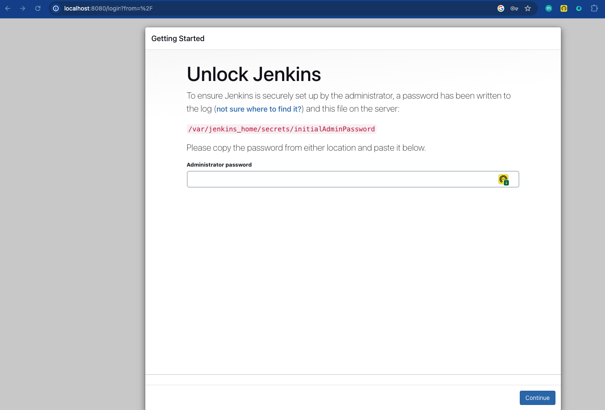
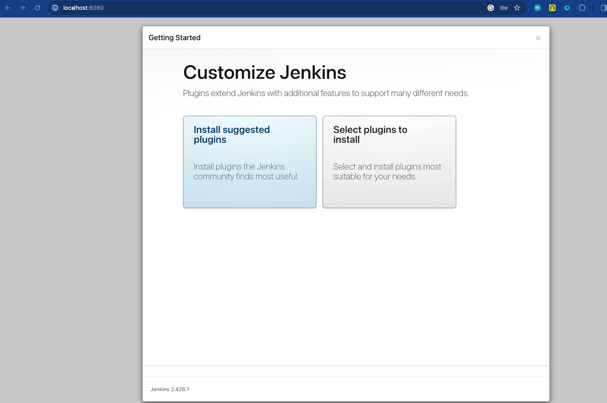
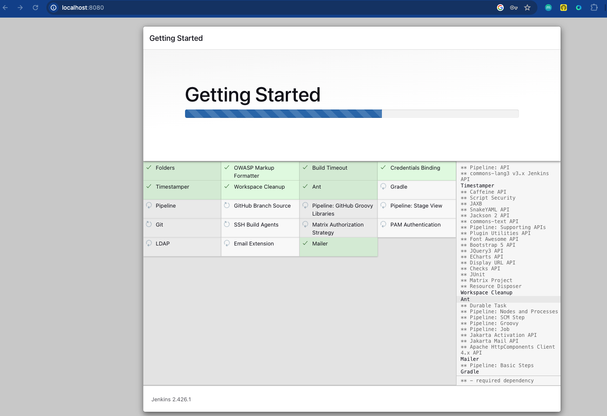
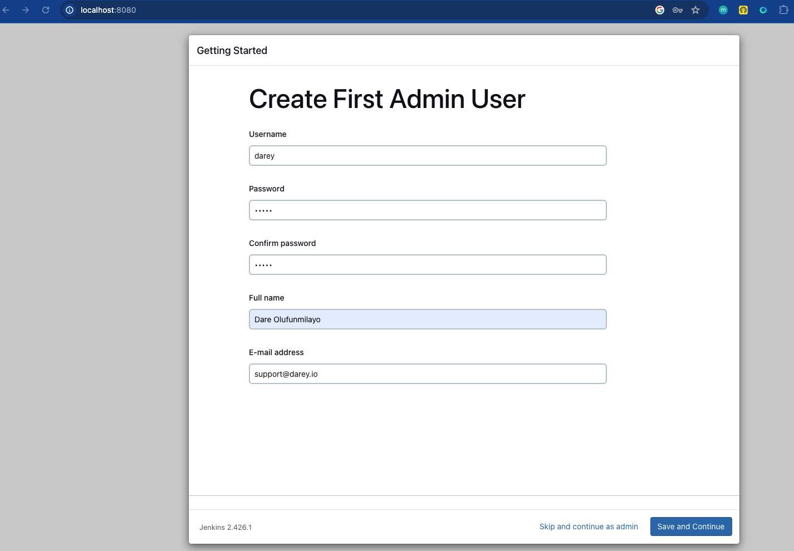
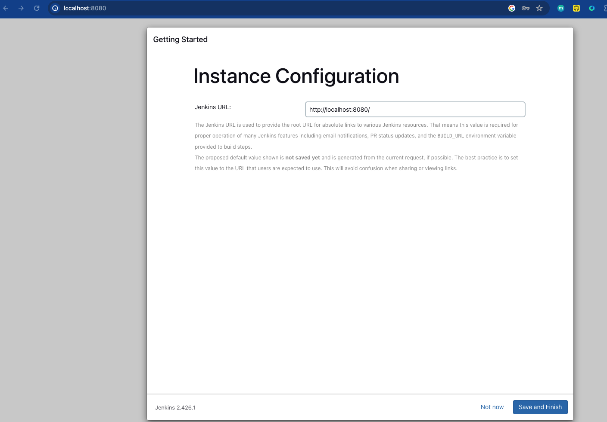
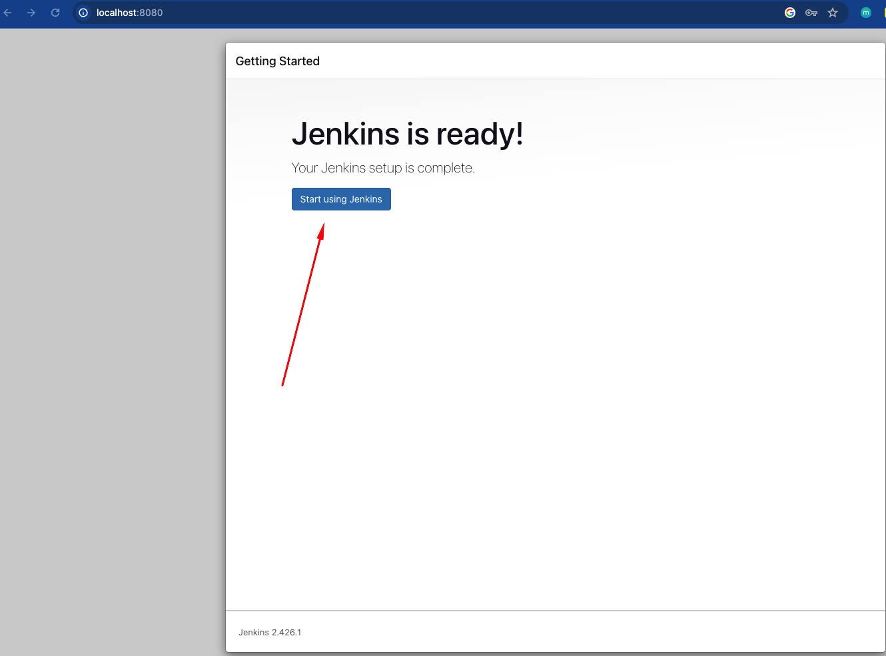
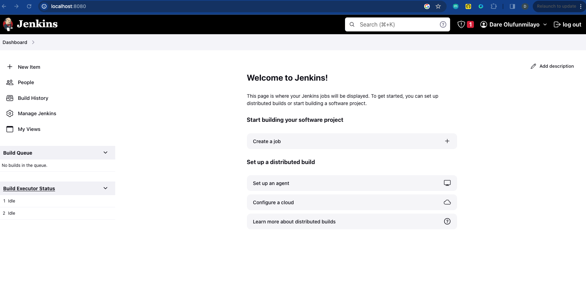

# Implementing CI/CD Pipeline for Terraform using Jenkins

Welcome to the comprehensive hands-on project on "Implementing CI/CD Pipeline for Terraform using Jenkins." In today's rapidly evolving IT landscape, efficient and reliable deployment of infrastructure is paramount. Continuous Integration and Continuous Deployment (CI/CD) have emerged as indispensable practices, fostering automation and agility in the software development lifecycle. In this project, we will explore the powerful combination of Terraform, a leading Infrastructure as Code (IaC) tool, and Jenkins, a widely-used automation server, to streamline and enhance infrastructure deployment workflows.

## Project Overview:
In the journey ahead, we will delve into the intricacies of building a robust CI/CD pipeline specifically tailored for Terraform projects.
By automating the building, testing, and deployment of infrastructure changes, these pipelines enhance speed, reliability, and consistency across environments. The use of Infrastructure as Code (IaC) with Terraform ensures reproducibility and scalability, while Jenkins facilitates collaborative development, visibility, and continuous integration and deployment as you will see in this project. This approach not only reduces time-to-market but also promotes resource efficiency, cost optimization, and compliance with security standards. Overall, CI/CD pipelines with Terraform and Jenkins empower organizations to adapt quickly to changing business requirements, fostering a culture of automation and continuous improvement in the dynamic landscape of modern software development and operations.


## Setting Up the Environment

Let's start the project by setting up a Jenkins server running in a docker container.

We will create a Dockerfile to define the configuration for our Jenkins server. This Dockerfile will include the necessary dependencies and configurations to run Jenkins seamlessly, and also to run terraform cli.


### Dockerfile for Jenkins

Jenkins comes with a docker image that can be used out of the box to run a container with all the relevant dependencies for Jenkins. But because we have unique requirement to run terraform, we need to find a way to extend the readily available jenkins image.

The Jenkins official docker image can be found [here](https://hub.docker.com/_/jenkins/)

Extending this image means we have to write our own dockerfile, and include all the other stuff we need. Lets go through that quickly.

1. Create a directory and name it `terraform-with-cicd`
2. create a file and name it `Dockerfile`
3. Add the below content in the dockerfile
   ```
    # Use the official Jenkins base image
    FROM jenkins/jenkins:lts

    # Switch to the root user to install additional packages
    USER root

    # Install necessary tools and dependencies (e.g., Git, unzip, wget, software-properties-common)
    RUN apt-get update && apt-get install -y \
        git \
        unzip \
        wget \
        software-properties-common \
        && rm -rf /var/lib/apt/lists/*

    # Install Terraform
    RUN apt-get update && apt-get install -y gnupg software-properties-common wget \
        && wget -O- https://apt.releases.hashicorp.com/gpg | gpg --dearmor | tee /usr/share/keyrings/hashicorp-archive-keyring.gpg \
        && gpg --no-default-keyring --keyring /usr/share/keyrings/hashicorp-archive-keyring.gpg --fingerprint \
        && echo "deb [signed-by=/usr/share/keyrings/hashicorp-archive-keyring.gpg] https://apt.releases.hashicorp.com $(lsb_release -cs) main" | tee /etc/apt/sources.list.d/hashicorp.list \
        && apt-get update && apt-get install -y terraform \
        && rm -rf /var/lib/apt/lists/*

    # Set the working directory
    WORKDIR /app

    # Print Terraform version to verify installation
    RUN terraform --version

    # Switch back to the Jenkins user
    USER jenkins

   ```

### Explaining the dockerfile
Before we proceed to building our custom jenkins image for terraform, lets go through that Dockerfile to understand what is going on step by step.

#### 1. Use the official Jenkins base image
```
FROM jenkins/jenkins:lts
```
This line specifies the base image for your Dockerfile. In this case, it's using the official Jenkins LTS (Long Term Support) image as a starting point.

#### 2. Switch to the root user to install additional packages

```
USER root
```

This command switches to the root user within the Docker image. This is done to perform actions that require elevated permissions, such as installing packages.

#### 3. Install necessary tools and dependencies (e.g., Git, unzip, wget, software-properties-common)
```
RUN apt-get update && apt-get install -y \
    git \
    unzip \
    wget \
    software-properties-common \
    && rm -rf /var/lib/apt/lists/*
```

This section installs various tools and dependencies needed for the image. The `apt-get update` command refreshes the package list, and `apt-get install` installs the specified packages `(git, unzip, wget, software-properties-common)`. The `&&` is used to chain commands, and `rm -rf /var/lib/apt/lists/*` removes unnecessary package lists, helping to reduce the size of the Docker image.


#### 4. Install Terraform
```
RUN apt-get update && apt-get install -y gnupg software-properties-common wget \
    && wget -O- https://apt.releases.hashicorp.com/gpg | gpg --dearmor | tee /usr/share/keyrings/hashicorp-archive-keyring.gpg \
    && gpg --no-default-keyring --keyring /usr/share/keyrings/hashicorp-archive-keyring.gpg --fingerprint \
    && echo "deb [signed-by=/usr/share/keyrings/hashicorp-archive-keyring.gpg] https://apt.releases.hashicorp.com $(lsb_release -cs) main" | tee /etc/apt/sources.list.d/hashicorp.list \
    && apt-get update && apt-get install -y terraform \
    && rm -rf /var/lib/apt/lists/*
```

This block installs Terraform. It follows similar steps as before: updating the package list, installing dependencies, adding HashiCorp's GPG key, configuring the repository, updating again, and finally installing Terraform. Again, it includes cleaning up unnecessary package lists.

**A quick note on GPG Key:** GPG (GNU Privacy Guard) is a free and open-source software for encrypting and signing data. In the context of software distribution, GPG keys are used to verify the integrity and authenticity of packages.

If you really want to get into the details of what the block of code is doing you can read the next section, otherwise you can skip to the next part of the dockerfile.

1. Downloading HashiCorp's GPG key:
```
wget -O- https://apt.releases.hashicorp.com/gpg | gpg --dearmor | tee /usr/share/keyrings/hashicorp-archive-keyring.gpg
```
- This command downloads HashiCorp's GPG key from `https://apt.releases.hashicorp.com/gpg`
- `gpg --dearmor` converts the key into a format that can be easily used by tools.
- `tee /usr/share/keyrings/hashicorp-archive-keyring.gpg` writes the key to the specified file with `.gpg` extension.

2. Displaying the GPG key fingerprint:
```
gpg --no-default-keyring --keyring /usr/share/keyrings/hashicorp-archive-keyring.gpg --fingerprint
```
- This command displays the fingerprint of the GPG key. The fingerprint is a unique identifier for the key and is used to verify its authenticity.
  
3. Configuring the repository with the GPG key:
   ```
   echo "deb [signed-by=/usr/share/keyrings/hashicorp-archive-keyring.gpg] https://apt.releases.hashicorp.com $(lsb_release -cs) main" | tee /etc/apt/sources.list.d/hashicorp.list
   ```
- This command adds HashiCorp's repository configuration to the system's package manager (apt in this case).
- It specifies the GPG key to be used for package verification.

4. Updating and installing Terraform:
```
RUN apt-get update && apt-get install -y terraform && rm -rf /var/lib/apt/lists/*
```
- These commands update the package list, install Terraform, and then remove unnecessary package lists to reduce the size of the Docker image.

#### 5. Set the working directory
```
WORKDIR /app
```

This line sets the working directory for subsequent commands to `/app`. This is where you'll be when you enter the container.

#### 6. Print Terraform version to verify installation
```
RUN terraform --version
```

This command prints the version of Terraform to the console, allowing you to verify that the installation was successful.

#### 7. Switch back to the Jenkins user
```
USER jenkins
```

Finally, this line switches back to the jenkins user, returning to a lower privilege level. This is a good security practice to minimize the risk of running processes as the root user within the container.

### Building and running the docker image

Now you should understand clearly that our mission right now is to have a docker container running Jenkins, but also have terraform installed.

Next is to build the docker image, and run it for further configuration.

Make sure that you are inside the folder containing the `Dockerfile`. This is generally referred to as the `Docker Build Context`. The build context is the set of files located in the specified directory or path when you build a Docker image using the `docker build command`. The content of the build context is sent to the Docker daemon during the build process, and it serves as the source for building the Docker image.

1. Build the custom jenkins image
   ```
    docker build -t jenkins-server . 
   ```
   Notice the "`.`"  at the end. That is the `docker build context`, meaning the current directory where the Dockerfile is.
2. Run the image into a docker container
   ```
   docker run -d -p 8080:8080 --name jenkins-server jenkins-server 
   ```
   This should output a hash data like:

   ```
   800f8f48466b3419d7cbf37908b12f146120b31260147bdd3b433d23e60f976b
   ```

**Lets break down that command for clear understanding.**

- `docker run`: This is the command used to run a Docker container.

- `-d`: This flag stands for "detach." It runs the container in the background, allowing you to continue using the terminal for other commands.

- `-p 8080:8080`: This flag maps the port `8080` from the host to the port `8080` inside the container. It means that you can access the application running inside the container on your host machine's port 8080. Simply go to the browser and put in there `localhost:8080` to display the application

- `--name jenkins-server`: This flag assigns a name to the container. In this case, the name is set to "`jenkins-server`"

- `jenkins-server`: This is the name of the Docker image that you want to run. It refers to the image named "`jenkins-server`" that was built earlier when we ran `docker build` command.


3. Check that the container is running: `docker ps`
   ```
    CONTAINER ID   IMAGE            COMMAND                  CREATED              STATUS              PORTS                               NAMES
    800f8f48466b   jenkins-server   "/usr/bin/tini -- /u…"   About a minute ago   Up About a minute   0.0.0.0:8080->8080/tcp, 50000/tcp   jenkins-server
   ```
4. Access the Jenkins server from the web browser on `localhost:8080`



5. Access the Jenkins Server directly inside the container
```
docker exec -it  800f8f48466b  /bin/bash
```

**Lets break down the command:**

- `docker exec`: This command is used to execute a command in a running Docker container.

- `-it`: These flags are often used together.

  - `-i` stands for "interactive," which allows you to interact with the container.
  - `-t` allocates a pseudo-TTY, or terminal, enabling a more interactive session.
- 800f8f48466b: This is the Container ID or Container Name. It uniquely identifies the running container. In this case, replace it with the actual ID or name of your container. You can get this from the output of `docker ps`

- `/bin/bash`: This is the command that you want to execute inside the container. In this example, it's launching an interactive Bash shell (bash) within the specified container.

So, when you run this command, Docker will:

- Use the `exec` command to execute a command in a running container.
- Use the `-it` flags to make the interaction with the container interactive.
- Specify the Container ID or Container Name (in this case, "800f8f48466b").
- Specify the command to execute inside the container, which is `/bin/bash`.

You will also notice that once you get into the container, the directory you get to find yourself is the `/app`. Which is from the `WORKDIR` directive inside the `Dockerfile`

docker exec -it  800f8f48466b  /bin/bash

```
jenkins@800f8f48466b:/app$ pwd
/app
```

6. Retrieve the initial Jenkins admin password

From the web UI, there is an instructon to retrieve the Initial Admin Password from `/var/jenkins_home/secrets/initialAdminPassword`

Inside the container, run:

- Retrieve password
```
jenkins@800f8f48466b:/app$ cat /var/jenkins_home/secrets/initialAdminPassword
a845868b3a404f39b48b1b05137b4888
```

7. Installing Jenkins plugins
   
- Paste the initial password in the web
- Click on "Install suggested plugins 




8. Create first admin user and access Jenkins 








