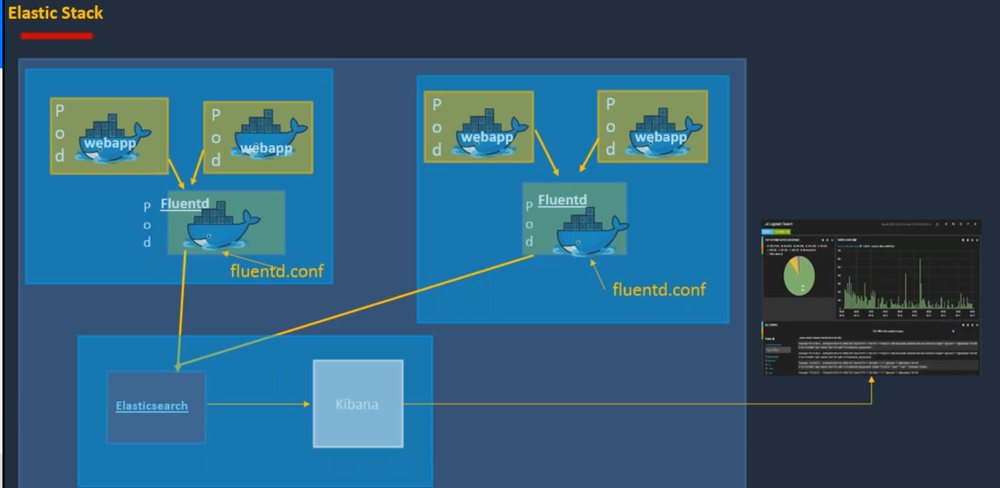

# Logging Fundamentals and Best Practices

## The Power of Logs: Why They Matter

Logs are essential for:

* **Troubleshooting:** Uncover and diagnose issues, bugs, and errors efficiently.
* **Security Monitoring:** Stay vigilant and detect suspicious activity or potential threats.
* **Performance Optimization:** Gain insights into your system's performance and optimize resource usage.
* **Auditing and Compliance:** Meet compliance requirements and track user activity effectively.

## Embracing Best Practices
* **Standardize Your Logging Format:** Utilize structured formats like JSON or XML for streamlined parsing and analysis.
* **Choose the Right Storage:** Pick a reliable and scalable storage solution based on your data volume and needs.
* **Centralize Your Logs:** Aggregate logs from diverse sources for comprehensive search and analysis.
* **Enable Log Rotation:** Implement automatic rotation to avoid disk space exhaustion.
* **Secure Your Logs:** Protect sensitive information through access control and encryption.
* **Monitor Your Logs:** Proactively set up alerts for critical events and errors.
* **Analyze Your Logs:** Extract valuable insights and trends from your log data.

## Centralized Logging with the ELK Stack

This section explores a common centralized logging approach utilizing the ELK Stack:

**Architecture:**

**Key Components:**

* **Fluentd:** A powerful log collector, gathering logs from individual Kubernetes pods.
* **Fluentd Configuration (fluentd.conf):** Defines how Fluentd operates, including data sources and destinations.
* **Elasticsearch:** A scalable database storing and indexing your log data for efficient retrieval.
* **Kibana:** A user-friendly dashboard visualizing and analyzing logs from Elasticsearch.

**Implementation Steps:**

1. **Deploy Fluentd as a DaemonSet:** Ensure every worker node runs Fluentd for comprehensive log collection.
2. **Configure Fluentd:** Customize fluentd.conf to specify log sources and send them to Elasticsearch.
3. **Deploy Elasticsearch:** Set up Elasticsearch to store and index your log data efficiently.
4. **Deploy Kibana:** Configure Kibana to connect to Elasticsearch and provide insightful visualizations.

**Connecting the Dots:**

* Fluentd pods access Elasticsearch using service accounts for secure communication.
* Elasticsearch, Kibana, and Fluentd pods run within Kubernetes and communicate via ClusterIP addresses.

**Benefits:**

* Centralized log management for easy search and analysis.
* Streamlined troubleshooting and performance monitoring.
* Enhanced security and compliance through centralized control.