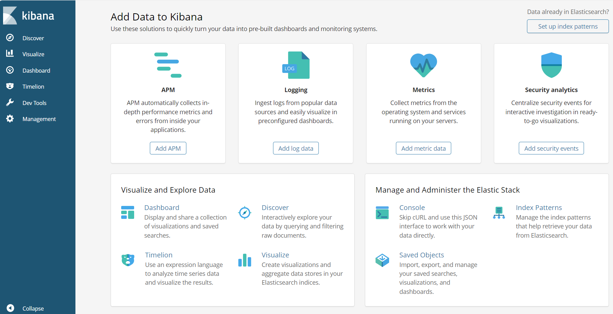
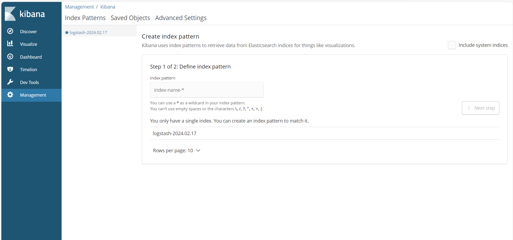
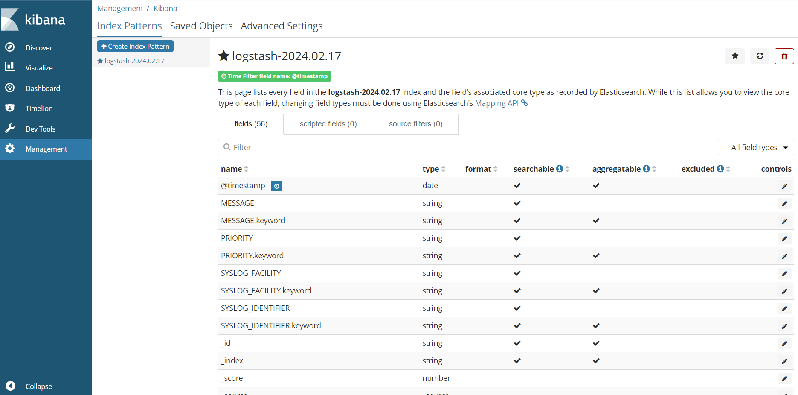
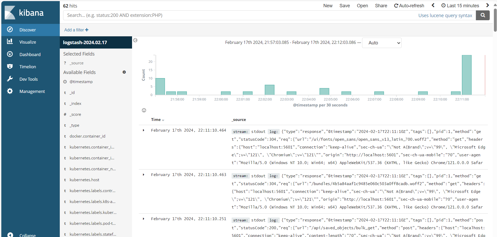

# Deploying and Configuring the ELK Stack in Kubernetes

1. **Create a directory:**


```
mkdir elastic stack
cd elastic stack

```
2. **Configure Fluentd:**

- Create a fluentd manifest file named [fluentd.yaml](../project62/fluentd.yaml).

This fluentd yaml file is a configuration file that defines how Fluentd, a log aggregator and processor, collects and sends logs to Elasticsearch in a Kubernetes environment. Here's a breakdown of its key components:

**Data sources (sources):**

* **system.conf:** This section defines how Fluentd reads logs from Docker containers running on the host system. It uses the tail plugin to follow log files and parses them using specific formats based on the source (e.g., Docker, Kubernetes logs).
* **journald-*:** These sections collect logs from systemd journal for specific services like Docker, kubelet, and kernel.
* **forward.input.conf:** This defines a source for receiving log messages sent over TCP, but it's not configured with any details in this snippet.
* **elasticsearch:** This section defines how Fluentd sends logs to Elasticsearch on the elasticsearch-logging host at port 9200. It buffers logs before sending them in batches for efficiency and uses exponential backoff for retries in case of temporary issues.
* **monitoring.conf:** This section enables Prometheus metrics collection for various Fluentd components.
* **system.input.conf:** This section defines additional log sources like minion logs and startupscript logs.

Overall, this configuration file ensures that logs from various sources within a Kubernetes cluster are collected, parsed, enriched with metadata, and sent to Elasticsearch for centralized storage and analysis.


```
vi fluentd.yaml
```
- Apply the configuration:

```
kubectl apply -f fluentd.yaml

```
- Verify deployment:

```
kubectl get configmap -n kube-system
```

## Deploying the ELK Stack

1. **Create a Manifest file:**

Create  a file named elastic-stack [elastic-stack](../project62/elastic-stack.yaml)

This file will deploy both Kibana and Elasticsearch.

```
vi elastic-stack.yaml

```
2.  **Configure the manifest:**

This file sets up a comprehensive logging and visualization system for your Kubernetes cluster, utilizing Fluentd, Elasticsearch, and Kibana. Here's a breakdown of the key components, incorporating the additional information you provided:

**Fluentd DaemonSet:**

* **Deployment kind:** DaemonSet ensures Fluentd runs on every node of your cluster, collecting logs from various sources like Docker containers, systemd journals, and more.
ServiceAccount: fluentd-es provides secure communication by granting specific permissions to Fluentd pods.
* **ClusterRole:** Defines permissions for Fluentd to "list, get, watch" pods and namespaces within the cluster, enabling it to discover and access log sources effectively.
* **ClusterRoleBinding:** Links the fluentd-es service account with the ClusterRole, establishing the necessary authorization.

**Elasticsearch:**

* **Pod replicas:** Deploys a cluster of Elasticsearch instances using StatefulSets, providing distributed storage and fault tolerance for your logs. The exact number of replicas (2 in this example) can be adjusted based on your needs and cluster resources.
* **Image source: **The configuration references the official k8s.gcr.io/elasticsearch:v6.2.5 image for deploying Elasticsearch pods.

**Kibana Deployment:**

* **Replicas:** Runs a single Kibana instance, providing a web-based interface for visualizing and analyzing logs stored in Elasticsearch.
* **Image source:** Utilizes the official docker.elastic.co/kibana/kibana-oss:6.2.4 image to deploy the Kibana pod.

**Kibana Service:**

* Type: Leverages the NodePort service type to expose Kibana through a specific port on each node, allowing external access via the assigned NodePort.


3. **Apply the configuration**

```
kubectl apply -f elastic-stack.yaml

```
4. **Verify deployment**

```
kubectl get pods -n kube-system
kubectl get nodes
```

* Fluentd will be created for each nodes within your cluster.

5. **Access Kibana:**

* Get the kibana service's NodePort:

Since this is a practice project, we're using a simpler approach to access Kibana called **NodePort**. 

This exposes Kibana on a specific port on each node in the cluster, similar to opening a specific door on each building in a practice village. While convenient, keep in mind that NodePort might be less secure than using a load balancer in real-world scenarios.

For projects requiring scalability, reliability, and advanced routing, choose a load balancer instead.

```
kubectl get service kibana-logging -n kube-system
```
* Forward the port to your local machine (using caution for security):

**Port forwarding** is useful for accessing a private service from the outside world by directing external traffic to a specific device on your network. Think of it like opening a specific door in your house for someone outside to reach a hidden room. It's handy for running personal servers, gaming with friends, or remotely accessing devices when away from home. But remember, use it with caution as it creates an open pathway, so prioritize strong passwords and proper security measures.

```
kubectl port-forward service/kibana-logging -n kube-system 5601:5601
```

* Access Kibana in your browser: http://localhost:5601

```
http://localhost:5601 in your browser
```


## Setting Up Kibana

1. **Go to Management > Advanced Settings**

2. **Create an index pattern:**

    * In the "Index name" field, enter "logstash-2024.02.17" (or your desired pattern).
    * Click "Next Step".

    

3. Configure settings:

    * Set "Time filter field name" to "@Timestamp".
    * Click "Create index pattern".

    

## Exploring Kibana

1. **Click on "Discover"**

2. **Search for logs with the word "error"**

 

3. **Analyze the results:**
    * See the number of generated logs and timestamps.
    * Identify containers reporting errors, types of errors, and timestamps.

4. **Drill down for specific pods:**
    * Search for logs based on pod names if you know which ones have issues.

    
    
5. **View logs at different levels:**
    * Explore logs at pod, namespace, and other levels.

## Additional Considerations

* **Production deployments:**
    * Use an internal load balancer instead of NodePort for better security.
    * Move Kibana to a dedicated namespace.
    * Avoid kubectl proxy due to potential vulnerabilities.
* **Further options:**
    * Explore external tools and integrations for advanced log analysis.
