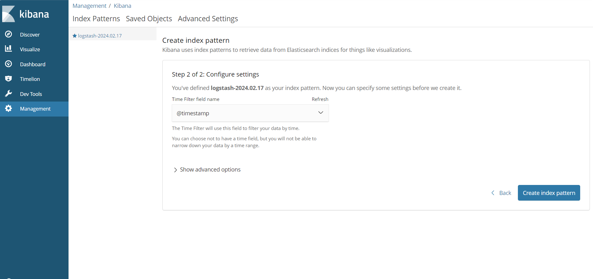

# Deploying and Configuring the ELK Stack in Kubernetes

1. **Create a directory:**

`Bash`

```
mkdir elastic stack
cd elastic stack

```
2. **Configure Fluentd:**

- Create a fluentd manifest file named [fluentd.yaml](../project62/fluentd.yaml).

- Specify the deployment kind as `DaemonSet` to ensure Fluentd runs on every node.

- Use vi fluentd.yaml to edit the configuration, defining log sources and sending them to Elasticsearch.

```
vi fluentd.yaml
```
- Apply the configuration:

```
kubectl apply -f fluentd.yaml

```
- Verify deployment:

```
kubectl get configmap -n kube-system
```

## Deploying the ELK Stack

1. **Create a Manifest file:**

Create  a file named elastic-stack [elastic-stack](../project62/elastic-stack.yaml)

This file will deploy both Kibana and Elasticsearch.

```
vi elastic-stack.yaml

```
2.  **Configure the manifest:**

* Define a ServiceAccount named fluentd-es for secure communication.
* Create a ClusterRole with permissions to "list, get, watch" pods and namespaces.
* Establish a ClusterRoleBinding to link the fluentd-es service account with the role.
* Specify pod replicas and image sources for Elasticsearch and Kibana.


3. **Apply the configuration**

```
kubectl apply -f elastic-stack.yaml

```
4. **Verify deployment**

```
kubectl get pods -n kube-system
kubectl get nodes
```

* Fluentd will be created for each nodes within your cluster.

5. **Access Kibana:**

* Get the kibana service's NodePort:

```
kubectl get service kibana-logging -n kube-system
```
* Forward the port to your local machine (using caution for security):

```
kubectl port-forward service/kibana-logging -n kube-system 5601:5601
```

* Access Kibana in your browser: http://localhost:5601

```
http://localhost:5601 in your browser
```


## Setting Up Kibana

1. **Go to Management > Advanced Settings**

2. **Create an index pattern:**

    * In the "Index name" field, enter "logstash-2024.02.17" (or your desired pattern).
    * Click "Next Step".

    

3. Configure settings:

    * Set "Time filter field name" to "@Timestamp".
    * Click "Create index pattern".

    

## Exploring Kibana

1. **Click on "Discover"**

2. **Search for logs with the word "error"**

 

3. **Analyze the results:**
    * See the number of generated logs and timestamps.
    * Identify containers reporting errors, types of errors, and timestamps.

4. **Drill down for specific pods:**
    * Search for logs based on pod names if you know which ones have issues.

    
    
5. **View logs at different levels:**
    * Explore logs at pod, namespace, and other levels.

## Additional Considerations

* **Production deployments:**
    * Use an internal load balancer instead of NodePort for better security.
    * Move Kibana to a dedicated namespace.
    * Avoid kubectl proxy due to potential vulnerabilities.
* **Further options:**
    * Explore external tools and integrations for advanced log analysis.
