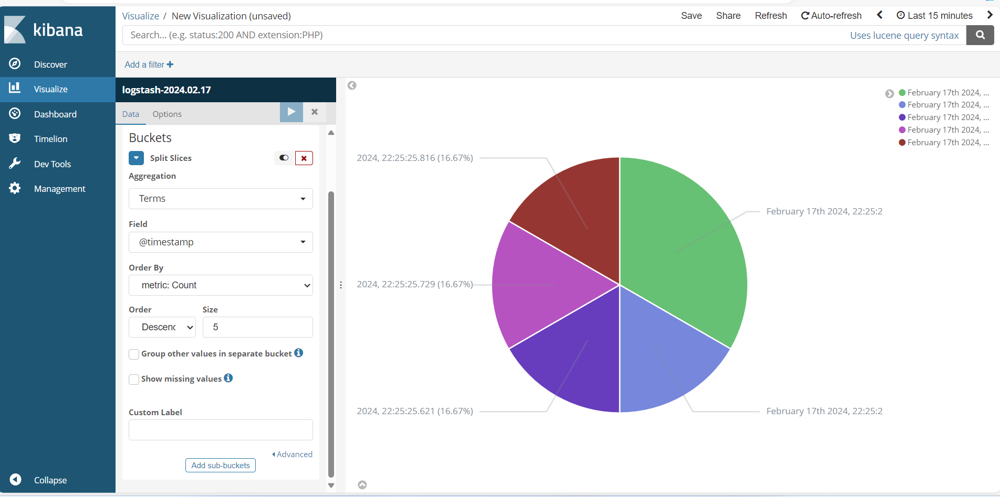

# Building a Pie Chart in Kibana

This guide walks you through building a pie chart in Kibana to visualize your collected log data:

1. **Access Kibana's Visualization Menu:**

* Navigate to "Discover" within Kibana.
* Click on "Visualizations" in the top menu bar.
* Select "Create Visualization" to begin creating your custom chart.

2. **Choose the Pie Chart Visualization Type:**

* From the available visualization options, select "Pie" to create a circular representation of your data.

3. **Select the Data Source:**

* In the "Data source" dropdown, choose "logstash-2024.02.17" (or your desired index pattern).

4. **Configure Chart Options:**

* Uncheck the "Donut" box to display solid pie slices instead of a hollow ring.
* Check the "Show labels" box to display labels for each slice.

5. **Define Slices and Aggregation:**

* Under "Data" settings, locate the "Buckets" section.
* Choose "Split slices" to separate data into individual slices.
* Under "Aggregate," select "Terms" to group data by its values.
* In the "Field" dropdown, choose "@TimeStamps" to analyze timestamps.

6. **Preview and Save:**

* Click the "Play" symbol (>) to apply your configured settings and preview the updated chart.
* Adjust labels or further customizations as needed.
* Click "Save" to store your created visualization for future use.

Read more on [Dashboard](https://www.elastic.co/videos/training-how-to-series-stack?elektra=kibana-dashboard).

**Additional Tips:**

* Use filters to narrow down your data and focus on specific timeframes or events.
* Experiment with different visualization types like bar charts or line graphs for diverse insights.
* Explore Kibana's documentation for more advanced chart customization and data analysis techniques.

# Dashboard Management

1. **Access Dashboard Management:**

* Navigate to the "Dashboards" tab in Kibana.
* Click on "Create dashboard" to start building your personalized dashboard.

2. **Add the Pie Chart Panel:**

* Click the "+" icon in the panel section of your dashboard.
* Select "Visualization" from the available options.
* In the search bar, type the title or description of your saved pie chart (e.g., "Pie Chart - Timestamp Distribution").
* Click on the visualization to add it to your dashboard.

3. **Customize the Panel:**

* You can resize the panel by dragging its edges.
* Click the gear icon (⚙️) to access panel settings.
* Adjust the title, color scheme, or other settings according to your preferences.

4. **Add Additional Panels (Optional):**

* Repeat steps 2 and 3 to add other visualizations to your dashboard, such as:
* Line charts to track trends over time.
* Bar charts to compare different categories.
* Map visualizations to analyze geo-distributed data.
* Arrange your panels strategically for optimal information flow and insights.

5. **Save and Share Your Dashboard:**

* Click the "Save" button to store your personalized dashboard.
* Give it a descriptive name for easy identification.
* You can share your dashboard with other users who have access to Kibana.

## Tips for Effective Dashboards:

* Combine various visualization types to provide diverse perspectives on your data.
* Label panels clearly and use intuitive layouts for easy understanding.
* Filter data consistently across visualizations for meaningful comparisons.
* Consider using color schemes that are accessible and visually appealing.
