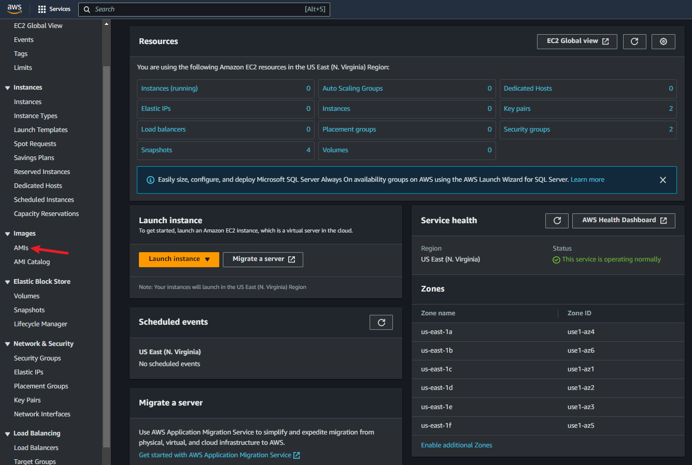

Devops Tooling Website Solution
=====================================

In previous [Project 6](https://professional-pbl.darey.io/en/latest/project6.html) you implemented a WordPress based solution that is ready to be filled with content and can be used as a full fledged website or blog. Moving further we will add some more value to our solutions that your DevOps team could utilize. We want to introduce a set of DevOps tools that will help our team in day to day activities in managing, developing, testing, deploying and monitoring different projects.

The tools we want our team to be able to use are well known and widely used by multiple DevOps teams, so we will introduce a single DevOps Tooling Solution that will consist of:
1. [Jenkins](https://www.jenkins.io) - free and open source automation server used to build [CI/CD](https://en.wikipedia.org/wiki/CI/CD) pipelines.
2. [Kubernetes](https://kubernetes.io) - an open-source container-orchestration system for automating computer application deployment, scaling, and management.
3. [Jfrog Artifactory](https://jfrog.com/artifactory/) - Universal Repository Manager supporting all major packaging formats, build tools and CI servers. Artifactory.
4. [Rancher](https://rancher.com/products/rancher/) - an open source software platform that enables organizations to run and manage [Docker](https://en.wikipedia.org/wiki/Docker_(software)) and Kubernetes in production.
5. [Grafana](https://grafana.com) - a multi-platform open source analytics and interactive visualization web application.
6. [Prometheus](https://prometheus.io) - An open-source monitoring system with a dimensional data model, flexible query language, efficient time series database and modern alerting approach.
7. [Kibana](https://www.elastic.co/kibana) - Kibana is a free and open user interface that lets you visualize your [Elasticsearch](https://www.elastic.co/elasticsearch/) data and navigate the [Elastic Stack](https://www.elastic.co/elastic-stack).

**Note:** Do not feel overwhelmed by all the tools and technologies listed above, we will gradually get ourselves familiar with them in upcoming projects!

#### Side Self Study

Read about [Network-attached storage (NAS)](https://en.wikipedia.org/wiki/Network-attached_storage), [Storage Area Network (SAN)](https://en.wikipedia.org/wiki/Storage_area_network) and related protocols like NFS, (s)FTP, SMB, iSCSI. Explore what [Block-level storage](https://en.wikipedia.org/wiki/Block-level_storage) is and how it is used by Cloud Service providers, know the difference from [Object storage](https://en.wikipedia.org/wiki/Object_storage).
On the [example of AWS services](https://dzone.com/articles/confused-by-aws-storage-options-s3-ebs-amp-efs-explained) understand the difference between Block Storage, Object Storage and Network File System.

#### Setup and technologies used in Project 7

As a member of a DevOps team, you will implement a tooling website solution which makes access to DevOps tools within the corporate infrastructure  easily accessible.

In this project you will implement a solution that consists of following components:

1. **Infrastructure**: AWS  
2. **Webserver Linux**: Red Hat Enterprise Linux 8  
3. **Database Server**: Ubuntu  20.04 + MySQL
4. **Storage Server**: Red Hat Enterprise Linux 8 + NFS Server 
5. **Programming Language**: PHP   
6. **Code Repository**: [GitHub](https://github.com/darey-io/tooling.git) 

## For Rhel 8 server use this ami `ami-07b1305cd78401892`

 

On the diagram below you can see a common pattern where several stateless Web Servers share a common database and also access the same files using [Network File Sytem (NFS)](https://en.wikipedia.org/wiki/Network_File_System) as a shared file storage. Even though the NFS server might be located on a completely separate hardware - for Web Servers it look like a local file system from where they can serve the same files.

It is important to know what storage solution is suitable for what use cases, for this - you need to answer following questions: what data will be stored, in what format, how this data will be accessed, by whom, from where, how frequently, etc. Base on this you will be able to choose the right storage system for your solution. 

#### Instructions On How To Submit Your Work For Review And Feedback

To submit your work for review and feedback - follow [**this instruction**](https://starter-pbl.darey.io/en/latest/submission.html).

